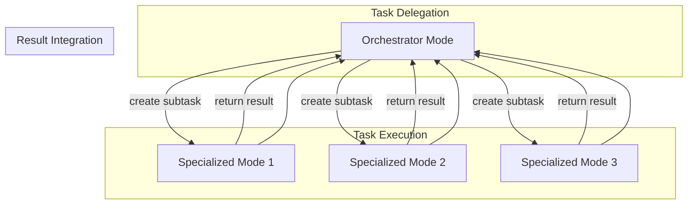
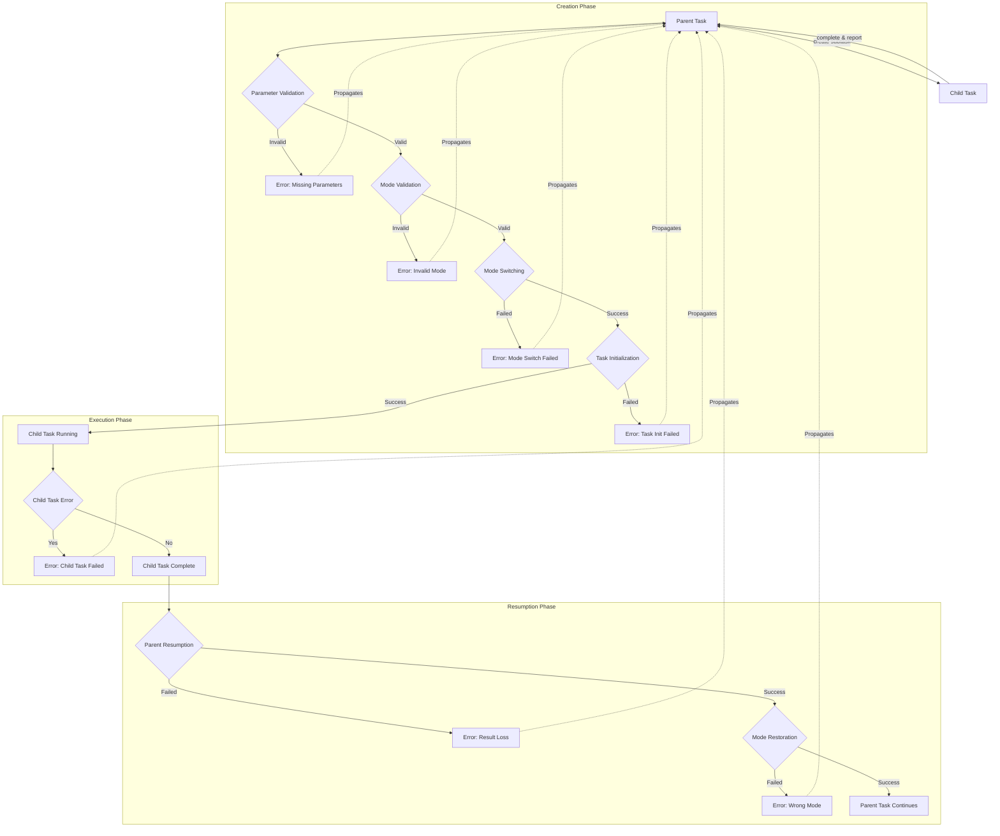

# Boomerang Task System Architecture Analysis

## Executive Summary

The Boomerang task system in Roo Code is a sophisticated task delegation and coordination mechanism that enables complex workflows through task decomposition and specialist mode collaboration. This document provides a comprehensive analysis of its architecture, identifies the key code paths involved in task delegation, and maps potential error propagation points.

The analysis reveals that the Boomerang task system is implemented through a well-defined parent-child task relationship pattern that facilitates:
1. Task creation and delegation from orchestrator to specialized modes
2. Task pausing and resuming mechanisms that maintain context
3. Result communication channels between parent and child tasks
4. Mode-appropriate task handling through automatic mode switching

Several critical error propagation points were identified, primarily centered around task state transitions, inter-task communication, and mode switching operations.

## 1. Architecture of the Boomerang Task System

### 1.1 Architectural Overview

The Boomerang task system is designed around a central metaphor: tasks are "thrown out" from a coordinator (typically the orchestrator mode) to specialized modes and "return" (boomerang back) with their results when completed.



The system operates on three fundamental principles:
1. **Delegation**: Parent tasks delegate specific work to child tasks
2. **Specialization**: Child tasks run in specialized modes appropriate to their function
3. **Boomerang**: Results return to the parent task upon completion

### 1.2 Core Components

The Boomerang task system consists of the following key components:

#### 1.2.1 Task Class
The `Task` class (`src/core/task/Task.ts`) is the foundational component that maintains:
- **Task Identity**: Unique IDs and relationships (parent-child)
- **Task State**: Execution state including paused/resumed status
- **Task Communication**: Message handling between parent-child tasks
- **Mode Context**: Current and paused mode information

#### 1.2.2 The New Task Tool
The `new_task` tool is the primary interface for creating subtasks:
- Implemented in `src/core/tools/newTaskTool.ts`
- Described to users in `src/core/prompts/tools/new-task.ts`
- Invoked by modes (particularly orchestrator) to delegate subtasks

#### 1.2.3 Orchestrator Mode
The orchestrator mode (`src/shared/modes.ts`) serves as the primary entry point for task delegation:
- Breaks down complex tasks into discrete subtasks
- Determines appropriate specialized modes for each subtask
- Manages the overall task workflow
- Synthesizes results from completed subtasks

#### 1.2.4 Task Tracking System
The tracking system maintains the state of all tasks:
- `.roo/boomerang-state.json` tracks task statuses
- Events communicate state changes between tasks

### 1.3 Architectural Patterns

The Boomerang task system employs several key architectural patterns:

#### 1.3.1 Parent-Child Relationship Pattern
Tasks are organized in a hierarchical structure where:
- Parent tasks delegate to and wait for child tasks
- Child tasks execute specific functions and report back
- Results propagate up the task hierarchy

#### 1.3.2 Mode Switching Pattern
Tasks operate in specific modes that are optimized for particular functions:
- Mode is switched when creating a new task
- Original mode is preserved and restored when returning to the parent task
- Mode-specific behavior is enforced through mode configuration

#### 1.3.3 Event-Driven Communication Pattern
Task state changes are communicated through events:
- "taskSpawned" signals child task creation
- "taskPaused" indicates a parent task is waiting
- "taskUnpaused" signals resumption of a parent task
- "taskCompleted" indicates successful completion

## 2. Task Creation, Delegation, and Reporting Mechanisms

### 2.1 Task Creation Mechanism

The task creation process follows these steps:

1. **Invocation**: A mode (typically orchestrator) invokes the `new_task` tool
2. **Validation**: The tool validates that the requested mode exists
3. **Preparation**: The current mode is saved for later restoration
4. **Mode Switching**: The system switches to the requested mode
5. **Task Initialization**: A new task instance is created with the provided message
6. **Parent Pausing**: The parent task is paused to await completion
7. **Event Emission**: Events ("taskSpawned" and "taskPaused") are emitted

Key code path (`src/core/tools/newTaskTool.ts`):
```typescript
// Preserve the current mode so we can resume with it later
cline.pausedModeSlug = (await provider.getState()).mode ?? defaultModeSlug

// Switch mode first, then create new task instance
await provider.handleModeSwitch(mode)

// Delay to allow mode change to take effect before next tool is executed
await delay(500)

const newCline = await provider.initClineWithTask(message, undefined, cline)
cline.emit("taskSpawned", newCline.taskId)

// Set the isPaused flag to true so the parent task can wait for the sub-task to finish
cline.isPaused = true
cline.emit("taskPaused")
```

### 2.2 Task Delegation Process

The task delegation process in the orchestrator mode follows a defined pattern:

1. **Task Decomposition**: Breaking complex problems into logical subtasks
2. **Mode Selection**: Choosing appropriate specialized modes for each subtask
3. **Context Provision**: Including all necessary context from the parent task
4. **Scope Definition**: Specifying exactly what the subtask should accomplish
5. **Completion Signaling**: Instructing the subtask to signal completion using `attempt_completion`

From orchestrator mode instructions (`src/shared/modes.ts`):
```
For each subtask, use the `new_task` tool to delegate. Choose the most appropriate mode for the subtask's specific goal and provide comprehensive instructions in the `message` parameter. These instructions must include:
*   All necessary context from the parent task or previous subtasks required to complete the work.
*   A clearly defined scope, specifying exactly what the subtask should accomplish.
*   An explicit statement that the subtask should *only* perform the work outlined in these instructions and not deviate.
*   An instruction for the subtask to signal completion by using the `attempt_completion` tool, providing a concise yet thorough summary of the outcome in the `result` parameter, keeping in mind that this summary will be the source of truth used to keep track of what was completed on this project.
*   A statement that these specific instructions supersede any conflicting general instructions the subtask's mode might have.
```

### 2.3 Task Reporting Mechanism

When a subtask completes, it reports back to its parent task through the following process:

1. **Result Preparation**: The subtask prepares a concise summary of its outcome
2. **Completion Signaling**: The subtask uses the `attempt_completion` tool with its result
3. **Parent Resumption**: The parent task is resumed with the subtask's result
4. **Result Integration**: The parent task adds the subtask's result to its conversation history
5. **Mode Restoration**: The parent task switches back to its original mode

Key code path for parent resumption (`src/core/task/Task.ts`):
```typescript
public async resumePausedTask(lastMessage: string) {
    // Release this Cline instance from paused state
    this.isPaused = false
    this.emit("taskUnpaused")

    // Fake an answer from the subtask that it has completed running and
    // this is the result of what it has done - add the message to the chat
    // history and to the webview ui.
    try {
        await this.say("subtask_result", lastMessage)

        await this.addToApiConversationHistory({
            role: "user",
            content: [{ type: "text", text: `[new_task completed] Result: ${lastMessage}` }],
        })
    } catch (error) {
        this.providerRef
            .deref()
            ?.log(`Error failed to add reply from subtask into conversation of parent task, error: ${error}`)

        throw error
    }
}
```

## 3. Error Propagation Analysis

The analysis identified several key points where errors could propagate between parent tasks and child tasks:

### 3.1 Task Creation Error Propagation

**File: `src/core/tools/newTaskTool.ts`**
| Line(s) | Code Path | Error Propagation Risk |
|---------|-----------|------------------------|
| 30-42 | Parameter validation | Missing parameters could prevent task creation and leave the parent task expecting a response that never comes |
| 47-52 | Mode validation | Invalid mode selection could create an improperly configured task |
| 72-76 | Mode switching | Failures in mode switching could create a task in the wrong mode |
| 78-80 | Mode change delay | Race conditions if delay is insufficient |
| 81 | Task initialization | Failures here could leave parent task permanently paused |

### 3.2 Task Pausing Error Propagation

**File: `src/core/tools/newTaskTool.ts`**
| Line(s) | Code Path | Error Propagation Risk |
|---------|-----------|------------------------|
| 88-89 | Task pausing | If pausing fails or events aren't properly emitted, the parent-child relationship breaks down |

**File: `src/core/task/Task.ts`**
| Line(s) | Code Path | Error Propagation Risk |
|---------|-----------|------------------------|
| 906-916 | Wait for resume | Infinite waiting if child task never completes or fails to signal completion |

### 3.3 Task Resumption Error Propagation

**File: `src/core/task/Task.ts`**
| Line(s) | Code Path | Error Propagation Risk |
|---------|-----------|------------------------|
| 608-630 | Resume paused task | Errors in result handling could cause loss of task results |
| 617-622 | Message addition | Failures here could lead to incomplete or corrupted conversation history |
| 1000-1012 | Mode restoration | If mode switching fails during resumption, task continues in wrong mode |

### 3.4 Error Propagation Map



### 3.5 Critical Error Propagation Points

Based on the analysis, the following points represent the most critical risk areas for error propagation:

1. **Task State Transitions**
   - **File:** `src/core/task/Task.ts`
   - **Lines:** 906-916 (waitForResume), 608-630 (resumePausedTask)
   - **Risk:** Deadlocks or orphaned tasks if state transitions fail

2. **Inter-Task Communication**
   - **File:** `src/core/task/Task.ts`
   - **Lines:** 617-622 (result communication)
   - **Risk:** Lost or corrupted results between tasks

3. **Mode Context Preservation**
   - **File:** `src/core/tools/newTaskTool.ts`, `src/core/task/Task.ts`
   - **Lines:** 72-76 (newTaskTool.ts), 1000-1012 (Task.ts)
   - **Risk:** Mode confusion leading to inappropriate tool use or capabilities

4. **Error Handling in Task Loop**
   - **File:** `src/core/task/Task.ts`
   - **Lines:** 921-953 (initiateTaskLoop)
   - **Risk:** Unhandled exceptions breaking the task execution cycle

5. **Task Abortion Mechanism**
   - **File:** `src/core/task/Task.ts`
   - **Lines:** 866-900 (abortTask)
   - **Risk:** Resource leaks or inconsistent state if cleanup fails

## 4. Recommendations for Error Resilience

Based on the analysis of potential error propagation points, the following recommendations would enhance the robustness of the Boomerang task system:

1. **Implement Timeout Mechanisms**
   - Add configurable timeouts to the `waitForResume` method to prevent indefinite waiting
   - Implement graceful recovery for tasks that exceed their timeout

2. **Enhance State Validation**
   - Add explicit state validation before and after key transitions
   - Implement state recovery mechanisms for inconsistent states

3. **Improve Error Isolation**
   - Contain errors within subtasks to prevent propagation to parent tasks
   - Add error boundary mechanisms at task boundaries

4. **Robust Mode Restoration**
   - Implement fallback mechanisms for mode restoration failures
   - Add verification steps after mode switches

5. **Transaction-like Semantics**
   - Implement a two-phase commit pattern for critical state changes
   - Add rollback capabilities for failed operations

## 5. Conclusion

The Boomerang task system in Roo Code implements a sophisticated task delegation and coordination mechanism through parent-child task relationships, mode specialization, and event-driven communication. The system successfully enables complex workflows through task decomposition and specialist collaboration.

However, several critical points of potential error propagation exist, particularly around task state transitions, inter-task communication, and mode switching operations. Implementing the recommended error resilience measures would significantly enhance the system's robustness and reliability.

This analysis provides a foundation for understanding how errors might emerge and propagate in the Boomerang task system, supporting the broader goal of detecting and correcting emergent errors in Roo Code.