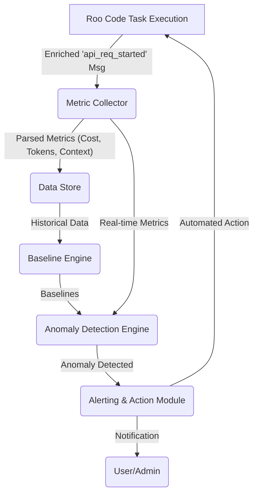

## 1. Introduction

This document outlines the design and implementation plan for a cost-anomaly detection system within Roo Code. The primary goal is to monitor token usage and associated costs to identify unusual patterns that might indicate errors, inefficiencies, unexpected LLM behavior, or potential budget overruns. This system aims to provide better visibility into operational costs, aligning with the insight: "Being able to see the dollars being spent in real time allows the overseer of this process to understand what's going on."

## 2. Analysis of Roo Code's Current Cost/Token Tracking Capabilities

Based on a review of the Roo Code codebase (primarily within `src/utils/`, `src/shared/`, `src/api/`, `src/core/task/`, and `src/schemas/`), Roo Code possesses a foundational system for tracking and calculating token usage and costs.

### 2.1. Model Configuration and Pricing:
*   **Source:** `src/shared/api.ts` (definitions) and `src/schemas/index.ts` (schema for `ModelInfo`).
*   **Details:** Roo Code maintains an extensive, hardcoded list of `ModelInfo` objects for numerous LLM providers (Anthropic, OpenAI, Bedrock, Vertex, Gemini, etc.) and router services (OpenRouter, LiteLLM, etc.).
*   Each `ModelInfo` entry stores:
    *   `inputPrice`, `outputPrice` (typically per million tokens).
    *   `cacheWritesPrice`, `cacheReadsPrice` (for models supporting prompt caching).
    *   Other metadata like `maxTokens`, `contextWindow`, `supportsImages`, etc.
    *   Some models have tiered pricing based on context window size (e.g., Gemini).
*   This centralized model and pricing information is crucial for internal cost calculations.

### 2.2. Token Counting:
*   **Primary Mechanism:** `src/utils/tiktoken.ts` utilizes the `tiktoken/lite` library with the `o200k_base` encoder (suitable for GPT-4o and similar models).
*   **Image Token Heuristic:** A custom heuristic `Math.ceil(Math.sqrt(base64Data.length))` is used for image data, with a fallback to 300 tokens for unknown images.
*   **`TOKEN_FUDGE_FACTOR`:** A multiplier of `1.5` is applied to the total calculated tokens (text + image) to "account for the fact that tiktoken is not always accurate." This significantly inflates the internally calculated token count compared to raw `tiktoken` output.
*   **Worker Pool:** `src/utils/countTokens.ts` can offload token counting to a worker thread for performance.
*   **Provider-Specific Counting:** The `ApiHandler` interface includes a `countTokens` method, allowing individual provider handlers to potentially override the default `tiktoken` implementation with native API calls for token counting if available.

### 2.3. Cost Calculation:
*   **Source:** `src/utils/cost.ts`.
*   **Logic:**
    *   `calculateApiCostInternal` takes `ModelInfo`, `inputTokens`, `outputTokens`, `cacheCreationInputTokens`, and `cacheReadInputTokens` to compute cost based on prices from `ModelInfo`.
    *   Separate wrappers `calculateApiCostAnthropic` and `calculateApiCostOpenAI` handle differences in how input tokens are reported relative to cached tokens by these providers.
*   This system calculates cost based on the token counts provided to it and the stored `ModelInfo`.

### 2.4. API Call Lifecycle and Data Capture:
*   **Source:** Primarily `src/core/task/Task.ts`.
*   **Messaging System:** Roo Code uses an internal messaging system (`ClineMessage`) to track interactions.
*   **`api_req_started` Message:**
    1.  An initial `api_req_started` message is emitted *before* the full prompt is finalized (contains the initial user request text).
    2.  This message is then *updated* with the final request payload after processing mentions and environment details.
    3.  Crucially, this same `api_req_started` message is updated *again* after the LLM API call completes (or during streaming) to include token counts and cost.
*   **Token/Cost Data Source within `Task.ts`:**
    *   The `ApiHandler` for the specific provider (e.g., `OpenAiNativeHandler`) is responsible for making the API call and processing its response stream.
    *   This stream yields `usage` chunks containing `inputTokens`, `outputTokens`, `cacheWriteTokens`, `cacheReadTokens`, and potentially a `totalCost` (if reported by the provider's API).
    *   `Task.ts` accumulates these token counts from the `usage` chunks.
    *   The `cost` recorded in the `api_req_started` message is either the `totalCost` from the `usage` chunk (if provided) or is calculated by `Task.ts` calling `calculateApiCostAnthropic` (from `cost.ts`) using the accumulated token counts and the model's `ModelInfo`.
*   **Consolidation:** The `api_req_started` message becomes a consolidated record for an API interaction, holding the request, token breakdown, and final cost.
*   **No `api_req_finished`:** The system has moved away from separate `api_req_finished` messages; all data is merged into the `api_req_started` message.

### 2.5. Data Aggregation and Storage:
*   **Aggregation:** `src/shared/getApiMetrics.ts` processes an array of `ClineMessage` objects (specifically the enriched `api_req_started` ones) to sum up `totalTokensIn`, `totalTokensOut`, `totalCacheWrites`, `totalCacheReads`, and `totalCost`, returning a `TokenUsage` object.
*   **Persistence (`ClineMessage`):** `Task.ts` calls `saveClineMessages()`, implying that the stream of `ClineMessage` objects (including the enriched `api_req_started` messages) is persisted, likely to disk on a per-task basis.
*   **Historical Aggregates (`HistoryItem`):** The `src/schemas/index.ts` defines `historyItemSchema`, which includes fields for `tokensIn`, `tokensOut`, `cacheWrites`, `cacheReads`, and `totalCost`. This indicates that aggregated metrics for tasks are stored as part of the task history. This historical data is vital for establishing baselines.

### 2.6. Summary of Current Capabilities & Gaps for Anomaly Detection:
*   **Strengths:**
    *   Detailed model pricing information is available (`ModelInfo`).
    *   Mechanisms exist to count tokens (though with a notable fudge factor and image heuristics).
    *   Cost calculation logic is in place.
    *   Per-API-call token counts and cost are captured and associated with `api_req_started` messages.
    *   Aggregated historical cost/token data is stored in `HistoryItem`s.
*   **Potential Gaps/Considerations for Anomaly Detection:**
    *   **Real-time Data Access:** While granular data is captured, it's primarily within the `ClineMessage` stream/storage. A dedicated, easily queryable data store for individual API call metrics optimized for real-time monitoring and trend analysis might be beneficial.
    *   **Token Count Accuracy:** The `TOKEN_FUDGE_FACTOR = 1.5` and custom image token heuristics mean Roo Code's internal token counts (and thus calculated costs) may differ from actual provider-billed tokens/costs. Anomaly detection should ideally be based on the most accurate figures possible, preferably those from API responses if available and reliable. The system needs clarity on whether the `usage` chunks from `ApiHandler` provide API-reported tokens or internally estimated ones.
    *   **Granularity for Baselines:** While `HistoryItem` provides task-level aggregates, more granular context (e.g., specific mode, sub-task type, user ID) associated directly with each API call's metrics would allow for more precise baseline creation and anomaly detection (e.g., "cost for summarization in research-mode" vs. "cost for code generation in code-mode").
    *   **No Existing Anomaly Detection Logic:** The current system focuses on tracking and calculation, not on actively identifying anomalous patterns in this data.

The existing infrastructure provides a solid foundation by capturing the necessary raw data (token counts and costs per API call). The next step is to design the system that consumes this data to detect anomalies.

## 3. Design of Cost Anomaly Detection System

This section details the proposed architecture, data flow, monitoring points, anomaly detection algorithms, and baseline establishment strategies.

### 3.1. System Architecture Overview

The proposed Cost Anomaly Detection System (CADS) will be integrated into Roo Code to monitor LLM API call costs and token usage in near real-time. It will consist of the following key components:

1.  **Metric Collector:** Hooks into the existing Roo Code system to capture finalized cost and token data for each LLM API call.
2.  **Data Store:** A dedicated time-series database (or a suitably indexed relational/document database) to store historical cost/token metrics with relevant context.
3.  **Baseline Engine:** Periodically analyzes historical data from the Data Store to establish and update dynamic baselines for various contexts.
4.  **Anomaly Detection Engine:** Compares incoming metrics from the Metric Collector against established baselines and predefined thresholds to identify anomalies.
5.  **Alerting & Action Module:** Manages notifications for detected anomalies and triggers predefined automated responses if necessary.



### 3.2. Data Points for Monitoring

The system will monitor the following data points for each LLM API call, extracted from the enriched `api_req_started` `ClineMessage` (specifically its JSON payload):

*   **`timestamp`**: Timestamp of the API call initiation.
*   **`taskId`**: Roo Code Task ID.
*   **`modelId`**: The specific LLM model used (e.g., "claude-3-7-sonnet-20250219").
*   **`modeSlug`**: The Roo Code mode active during the call (e.g., "code", "research").
*   **`tokensIn`**: Number of input tokens.
*   **`tokensOut`**: Number of output tokens.
*   **`cacheWrites`**: Number of tokens written to cache (if applicable).
*   **`cacheReads`**: Number of tokens read from cache (if applicable).
*   **`cost`**: Calculated or API-reported cost for the call (USD).
*   **`userId`**: (If available/relevant for multi-user Roo Code deployments).
*   **`operationType`**: A classification of the operation being performed (e.g., "code_generation", "summarization", "tool_reasoning_step"). This might require adding a new field to the `api_req_started` payload or inferring it from the context (e.g., active tool, nature of the prompt).

**Note on Token Count Accuracy:**
The system should prioritize using token counts directly reported by the LLM provider (if available in the `usage` chunks from `ApiHandler`). If Roo Code's internal `tiktoken.ts` (with its fudge factor) is used for these counts, this should be clearly flagged, as it might affect the accuracy of cost anomaly detection relative to actual billing. The design should allow for configuring which token source is considered primary.

### 3.3. Metric Collection and Storage

*   **Metric Collector:**
    *   This component will be integrated into `src/core/task/Task.ts`, specifically after the `api_req_started` message is fully enriched by `updateApiReqMsg` and before/during `saveClineMessages`.
    *   It will parse the JSON payload of the `api_req_started` message to extract the data points listed in section 3.2.
    *   It will then asynchronously send these structured metrics to the Data Store.
*   **Data Store:**
    *   A time-series database (e.g., InfluxDB, Prometheus) is recommended for storing these metrics due to its efficiency in handling timestamped data and performing time-windowed aggregations.
    *   Alternatively, a robust relational database (e.g., PostgreSQL) or a document store (e.g., Elasticsearch) with strong indexing on timestamp, `taskId`, `modelId`, `modeSlug`, and `operationType` could be considered if a dedicated TSDB is not feasible.
    *   The schema in the Data Store should accommodate all fields from section 3.2, plus an identifier for the source of token counts (API-reported vs. internally-calculated).
    *   Data retention policies should be configurable.

### 3.4. Baseline Establishment

Baselines are crucial for distinguishing normal fluctuations from genuine anomalies.

*   **Dynamic Baselines:** Baselines should not be static; they should adapt to evolving usage patterns. The Baseline Engine will be responsible for this.
*   **Contextual Baselines:** Baselines will be established for different contexts. A context is defined by a combination of:
    *   `modelId`
    *   `modeSlug`
    *   `operationType`
    *   Potentially `userId` (for user-specific baselines if needed).
*   **Metrics for Baselines:** For each context, baselines will be calculated for:
    *   Average `cost` per call.
    *   Average `tokensIn` per call.
    *   Average `tokensOut` per call.
    *   Average `totalTokens` (`tokensIn` + `tokensOut` + `cacheWrites` + `cacheReads`) per call.
    *   Standard deviation for each of the above averages.
    *   Percentiles (e.g., P50, P90, P95, P99) for these metrics.
*   **Calculation Period:** Baselines could be recalculated periodically (e.g., hourly for recent trends, daily for longer-term patterns) using a rolling window of historical data from the Data Store (e.g., last 24 hours, last 7 days).
*   **Initial Baselines:** When the system is first deployed, or for new contexts, initial baselines might be seeded from existing `HistoryItem` data (if applicable to the context) or set to conservative estimates derived from `ModelInfo` (e.g., average cost based on a typical small interaction). The system will then learn and refine these over time.
*   **Handling New Contexts:** When a new combination of `modelId`/`modeSlug`/`operationType` appears, the system might initially use global averages, broader category averages (e.g., average for the model across all modes), or a "learning mode" where it collects data for a period before setting a firm baseline.

### 3.5. Anomaly Detection Algorithms and Heuristics

The Anomaly Detection Engine will apply several techniques, ideally in a configurable manner:

1.  **Threshold-Based Alarms (Static/Configurable):**
    *   **Absolute Cost per API Call:** Flag if `cost` > `X_call_max_cost`.
    *   **Absolute Total Tokens per API Call:** Flag if `totalTokens` > `Y_call_max_tokens`.
    *   **Cumulative Cost per Task:** Track cumulative cost for the current `taskId`. Flag if `cumulativeTaskCost` > `Z_task_max_budget`. This requires the Metric Collector or Anomaly Detection Engine to maintain or query a running total for active tasks.
    *   **Cumulative Tokens per Task:** Similar to cost, flag if `cumulativeTaskTokens` > `W_task_max_tokens`.
    *   These thresholds (`X`, `Y`, `Z`, `W`) would be configurable globally and potentially per-mode or per-operationType.

2.  **Deviation from Dynamic Baselines (Statistical Anomalies):**
    *   For each incoming API call metric, compare its `cost`, `tokensIn`, `tokensOut`, `totalTokens` against the established baseline for its context (`modelId`, `modeSlug`, `operationType`).
    *   **Z-Score Method:** If a metric value is more than `N` standard deviations away from the baseline mean (e.g., `N=3`), flag it as an anomaly.
        *   `AnomalyScore = (CurrentValue - BaselineMean) / BaselineStdDev`
        *   Flag if `|AnomalyScore| > N_std_devs`.
    *   **Percentile Method:** If a metric value exceeds a high percentile (e.g., P99) of its historical distribution for that context, flag it.
    *   **Relative Change (Multiplier):** Flag if a metric value is `M` times higher than the baseline mean (e.g., `M=3` for a 200% increase).

3.  **Rate of Change Anomalies:**
    *   Monitor the rate of cost accumulation or token consumption over a short time window (e.g., last 5 minutes, last 10 API calls) for a specific task or user.
    *   Flag if the current rate significantly exceeds its recent moving average for that context.

4.  **Prompt/Response Token Ratio Anomalies:**
    *   Monitor the ratio of `tokensIn` to `tokensOut`.
    *   Establish baselines for this ratio per context.
    *   Flag significant deviations (e.g., an unusually high input-to-output ratio might indicate "prompt bloat" or an inefficient prompt).

5.  **Zero/Extremely Low Output Token Anomalies:**
    *   If `tokensOut` is consistently zero or extremely low for calls expected to produce substantial output (e.g., not for simple confirmations), flag as a potential issue (wasted input token cost).

**Example Anomaly Scenarios & Detection:**

*   **Scenario 1: Sudden Spike in Token Consumption for a Routine Task.**
    *   A task in "code-refactor" mode using "claude-3-7-sonnet" typically uses 500-1000 output tokens. A new call suddenly uses 15,000 output tokens.
    *   **Detection:** Z-score for `tokensOut` would be high; value might exceed P99; relative change multiplier exceeded.
*   **Scenario 2: Budget Threshold Exceeded.**
    *   A single task (`taskId`) has a predefined budget of $2.00. Cumulative cost for API calls within this task reaches $2.10.
    *   **Detection:** Threshold-based alarm on cumulative task cost.
*   **Scenario 3: Unexpectedly High Cost for a Simple Operation.**
    *   An `operationType="simple_qa"` in "ask" mode using "gpt-4o-mini" usually costs $0.001. A call costs $0.05.
    *   **Detection:** Z-score for `cost` would be high; relative change alarm.
*   **Scenario 4: Inefficient Prompting (Prompt Bloat).**
    *   For `operationType="generate_report"` with `modelId="gemini-2.5-pro"`, the `tokensIn`/`tokensOut` ratio is typically 0.5. It suddenly jumps to 3.0 for several consecutive calls.
    *   **Detection:** Deviation from baseline for prompt/response token ratio.

## 4. Integration with Roo Code

Integrating the CADS into Roo Code involves several touchpoints:

### 4.1. Metric Collector Integration:
*   **Location:** The Metric Collector logic will be primarily integrated within `src/core/task/Task.ts`.
*   **Trigger Point:** It will be triggered after the `api_req_started` `ClineMessage` has been fully updated with token counts and cost (i.e., after the `updateApiReqMsg` logic has run, typically at the end of processing the API stream or when the stream is aborted).
*   **Data Extraction:** The collector will parse the JSON from `this.clineMessages[lastApiReqIndex].text`.
*   **Contextual Information:**
    *   `taskId`: Available as `this.taskId`.
    *   `modelId`: Available from `this.api.getModel().id`.
    *   `modeSlug`: Can be obtained from `(await this.providerRef.deref()?.getState())?.mode`.
    *   `operationType`: This is a new piece of context.
        *   **Option 1 (Explicit Tagging):** Modify the system to tag operations. For example, when a tool is about to be called by the LLM, or when a specific type of user prompt is processed, this tag could be added to the `Task` state and included when the `api_req_started` message's JSON is initially formed or updated.
        *   **Option 2 (Inference):** Attempt to infer `operationType` based on the active tool being used (if any), keywords in the prompt, or the current mode's typical function. This is less reliable.
        *   **Recommendation:** Start with Option 1 for key operations if feasible, as it provides more accurate context for baselining.
*   **Asynchronous Submission:** The collector should send metrics to the Data Store asynchronously to avoid blocking the main task loop.

### 4.2. Data Store:
*   **Implementation Choice:**
    *   **Option A (External TSDB - Recommended for Scalability):** Use a lightweight TSDB like InfluxDB or Prometheus. This requires setting up and managing an external service. Roo Code would need a client library to send data.
    *   **Option B (Embedded/Local DB):** Use an embedded database like SQLite (with appropriate schema for time-series like data) or a local file-based system (e.g., append-only logs in Parquet/JSONL format that can be queried). Simpler to set up but may have performance/query limitations.
    *   **Option C (Leverage Existing Storage):** Extend the current `task-persistence` to store individual API call metrics in a more structured way than just within the `ClineMessage` stream. This might involve creating a new storage file per task or globally, optimized for querying these metrics.
*   **Recommendation:** Start with Option C if rapid integration is key, by creating a dedicated log file (e.g., `task_api_metrics.jsonl`) per task or globally, storing each API call's metric object. For long-term scalability and advanced querying, Option A is preferable.

### 4.3. Baseline Engine Integration:
*   **Execution:** The Baseline Engine can run as a background process or be triggered periodically (e.g., on Roo Code startup, or on a schedule if Roo Code runs continuously like a server).
*   **Data Source:** It will query the Data Store.
*   **Storage of Baselines:** Calculated baselines (mean, std_dev, percentiles per context) need to be stored where the Anomaly Detection Engine can access them quickly. This could be in-memory cache (if Roo Code is a single process), a fast key-value store, or within the Data Store itself.

### 4.4. Anomaly Detection Engine Integration:
*   **Trigger Point:** This engine will be invoked by the Metric Collector for each new API call metric.
*   **Logic:**
    1.  Retrieve the relevant baseline(s) for the current call's context (`modelId`, `modeSlug`, `operationType`).
    2.  Apply the configured anomaly detection algorithms (thresholds, Z-score, etc.).
    3.  If an anomaly is detected, pass the anomaly details (type, severity, context, metric values) to the Alerting & Action Module.
*   **Location:** This logic could reside in a new module, e.g., `src/core/monitoring/AnomalyDetector.ts`.

### 4.5. Configuration:
*   Anomaly detection parameters (thresholds, Z-score limits, percentile levels, active algorithms) should be configurable, potentially via Roo Code's settings system (`RooCodeSettings` in `src/schemas/index.ts`).

## 5. Alert Mechanisms and Automated Responses

### 5.1. Alerting Mechanisms:

When a cost anomaly is detected, the system should provide clear and timely notifications.

1.  **User Interface (Webview):**
    *   **Visual Indicators:** Display a persistent but non-intrusive indicator in the Roo Code webview when an anomaly is detected (e.g., a small icon in the status bar or next to the cost display).
    *   **Toast Notifications:** For moderate to severe anomalies, show a toast notification with a brief summary of the anomaly (e.g., "High token usage detected for last API call," "Task approaching budget limit").
    *   **Dedicated Monitoring Panel/View:** Consider a new panel in the webview where users can see a log of detected anomalies, current cost/token statistics for the active task, and potentially historical trends or baseline information.
    *   **New `ClineMessage` Type:** Introduce a new `ClineMessage` of `say: "cost_anomaly_detected"` with a `text` payload containing details of the anomaly. This allows the webview to render it in the chat stream if appropriate.
        ```json
        {
          "type": "cost_anomaly",
          "severity": "warning" | "error",
          "anomaly_type": "threshold_exceeded" | "baseline_deviation",
          "metric": "cost" | "totalTokens" | "inputTokens" | "outputTokens",
          "value": 0.50,
          "threshold": 0.20, // if applicable
          "baseline_mean": 0.10, // if applicable
          "std_devs_from_mean": 4.0, // if applicable
          "context": {
            "taskId": "...",
            "modelId": "...",
            "modeSlug": "...",
            "operationType": "..."
          },
          "message": "Cost for last API call ($0.50) significantly exceeded baseline ($0.10)."
        }
        ```

2.  **VS Code Notifications:**
    *   Utilize VS Code's native notification API (`window.showInformationMessage`, `window.showWarningMessage`, `window.showErrorMessage`) for more prominent alerts, especially for critical anomalies. These can include actionable buttons (e.g., "Pause Task," "View Details").

3.  **Logging:**
    *   Detailed anomaly information should be logged to Roo Code's standard logging system for diagnostic purposes. This log should include all contextual data, metric values, baseline values, and the type of anomaly detected.

### 5.2. Potential Automated Responses:

The system can be configured to take automated actions based on the severity and type of anomaly. These actions should generally be conservative to avoid undue disruption, with options for user override.

1.  **Pause Task:**
    *   **Trigger:** For severe anomalies (e.g., rapidly exceeding budget, extreme statistical deviation, repeated anomalies).
    *   **Action:** The current task (`Task.ts`) is paused. The user is notified and may need to manually resume or abort the task. This is the most direct way to prevent further cost overrun.
    *   **Implementation:** The `Task` class already has `isPaused` and related logic. The Anomaly Detection Engine would call a method on the `Task` instance to trigger a pause.

2.  **Require User Confirmation to Proceed:**
    *   **Trigger:** For moderate anomalies or when approaching a soft budget limit.
    *   **Action:** Before the next LLM API call is made for the current task, Roo Code uses the `ask` mechanism (`ClineAsk`) to prompt the user: "Warning: Recent activity shows unusually high token usage. Estimated cost for next step: $X.XX. Proceed?"
    *   **Implementation:** The Anomaly Detection Engine would set a flag on the `Task` instance. Before `attemptApiRequest`, `Task.ts` would check this flag and issue the `ask`.

3.  **Switch to a Cheaper Model/Mode (Advanced):**
    *   **Trigger:** Persistent moderate anomalies in a specific context, or when nearing a budget limit where a less capable but cheaper model might suffice.
    *   **Action:** Automatically (or with user confirmation) switch the `apiConfiguration` for the current task to a pre-configured cheaper alternative model or suggest switching to a less resource-intensive mode.
    *   **Implementation:** This is complex. It requires a mapping of "expensive" to "cheaper alternative" models and logic to handle the mode/API config switch gracefully within the active task.

4.  **Reduce Request Frequency / Implement Stricter Rate Limiting:**
    *   **Trigger:** If the rate of API calls itself is deemed anomalous (e.g., too many calls in a short period for a task that shouldn't be that intensive).
    *   **Action:** Temporarily increase the `rateLimitSeconds` for the current task or user.
    *   **Implementation:** The Anomaly Detection Engine would need to influence the rate-limiting parameters used in `Task.ts` when `attemptApiRequest` is called.

5.  **Enhanced Logging/Tracing:**
    *   **Trigger:** Any detected anomaly.
    *   **Action:** Automatically increase the verbosity of logging for the affected task or temporarily enable more detailed tracing to help diagnose the cause of the anomaly.

**Configuration:**
*   Users should be able to configure which automated responses are enabled and the severity levels that trigger them.
*   A "dry-run" mode for anomaly detection (log/alert only, no automated actions) would be beneficial initially.

## 6. Considerations for Baseline Usage Statistics

(To be detailed further - this was part of the original scope for section 3, will elaborate here)

*   **Data Collection for Baselines:** The `Data Store` (Section 3.3) is the source.
*   **Context Granularity:** As defined (model, mode, operationType). The `operationType` is key for meaningful baselines.
*   **Minimum Data Points:** A minimum number of data points (e.g., 20-50) should be required for a specific context before a statistically reliable baseline is established. Until then, broader averages or default estimates can be used.
*   **Handling Outliers in Baseline Calculation:** When calculating baselines (mean, std_dev), the Baseline Engine should employ methods to reduce the impact of extreme outliers in the historical data itself (e.g., using trimmed means, or excluding data points beyond a certain Z-score from the baseline calculation itself).
*   **Seasonality/Trends:** For long-running systems, consider if there are weekly/monthly trends in usage that baselines should adapt to (more advanced).
*   **User-Specific Baselines:** If Roo Code is used by multiple users with distinct usage patterns, user-specific baselines might be necessary for some anomaly checks (e.g., cumulative cost per user).
*   **Baseline Recalculation Strategy:**
    *   **Frequency:** Daily or weekly for stable metrics. More frequently (e.g., hourly on a rolling window) for metrics prone to rapid change or for new contexts.
    *   **Cold Start:** How to handle a new context with no historical data (e.g., use global defaults, learn for a period).
*   **Storing and Accessing Baselines:** Baselines need to be stored efficiently (e.g., in a cache or a dedicated table in the Data Store) for quick retrieval by the Anomaly Detection Engine.

## 7. Examples of Cost Anomalies and System Detection

(This was part of the original scope for section 3, will elaborate here based on the algorithms)

*   **Example 1: Single API Call Exceeds Hard Threshold**
    *   **Anomaly:** An API call to `gpt-4o` costs $1.50.
    *   **Configuration:** `X_call_max_cost` = $1.00.
    *   **Detection:** Threshold-Based Alarm. `cost` ($1.50) > `X_call_max_cost` ($1.00).
    *   **Alert/Action:** High-severity alert to user; option to pause task.

*   **Example 2: Token Usage Spike Compared to Baseline**
    *   **Context:** `modeSlug="code"`, `modelId="claude-3-7-sonnet"`, `operationType="generate_function"`.
    *   **Baseline:** `totalTokens` mean = 800, std_dev = 200.
    *   **Anomaly:** An API call uses 2000 `totalTokens`.
    *   **Configuration:** `N_std_devs` = 3.
    *   **Detection:** Z-Score. `(2000 - 800) / 200 = 6`. Since 6 > 3, it's an anomaly.
    *   **Alert/Action:** Medium-severity alert; log detailed context.

*   **Example 3: Task Budget Approaching Limit**
    *   **Context:** `taskId="abc-123"`.
    *   **Configuration:** `Z_task_max_budget` = $5.00. Soft limit warning at 80% ($4.00).
    *   **Anomaly:** Cumulative cost for `taskId="abc-123"` reaches $4.10.
    *   **Detection:** Threshold-Based Alarm (on cumulative task cost).
    *   **Alert/Action:** Informational alert "Task budget 82% used." If it later exceeds $5.00, a higher severity alert and option to pause.

*   **Example 4: Inefficient Prompting (High Input/Output Ratio)**
    *   **Context:** `modeSlug="research"`, `modelId="gemini-2.5-pro"`, `operationType="summarize_document"`.
    *   **Baseline:** `tokensIn`/`tokensOut` ratio mean = 0.2, std_dev = 0.05.
    *   **Anomaly:** An API call has `tokensIn`=1000, `tokensOut`=500. Ratio = 2.0.
    *   **Configuration:** `N_std_devs` for ratio = 4.
    *   **Detection:** Z-Score on ratio. `(2.0 - 0.2) / 0.05 = 36`. Highly anomalous.
    *   **Alert/Action:** Warning alert suggesting prompt review; log prompt for analysis.

(Final review and memory update will follow completion of the specification.)