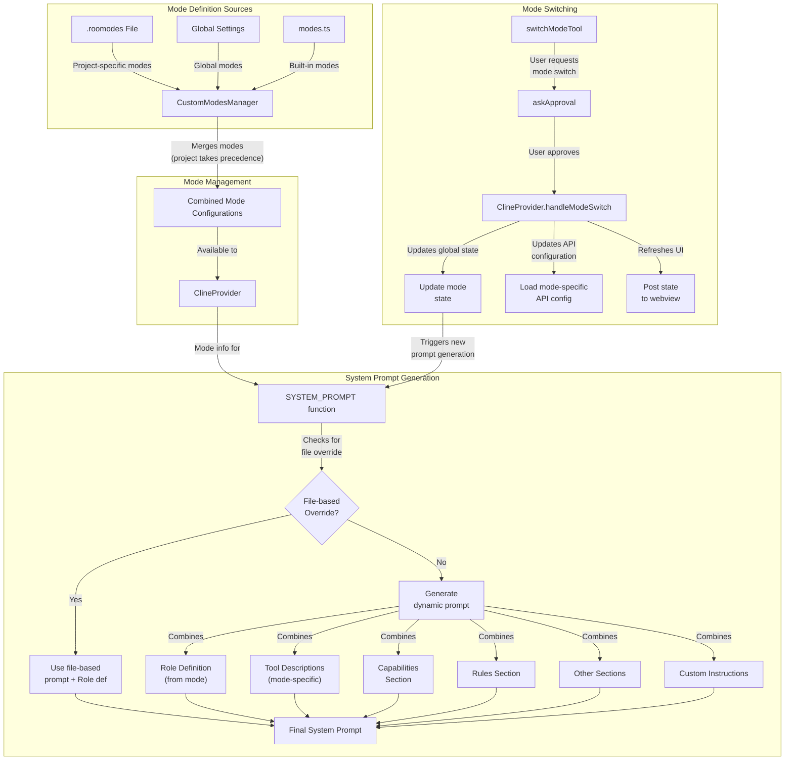
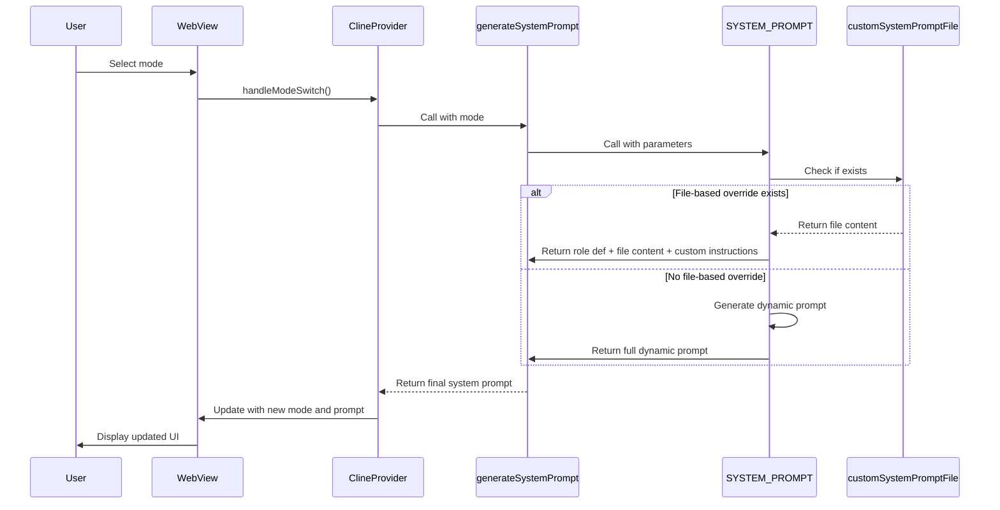
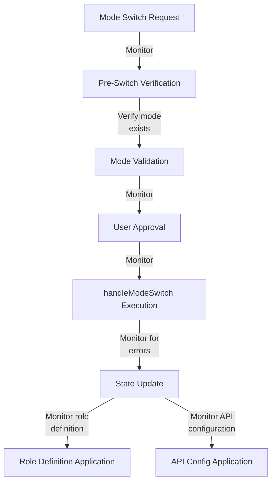
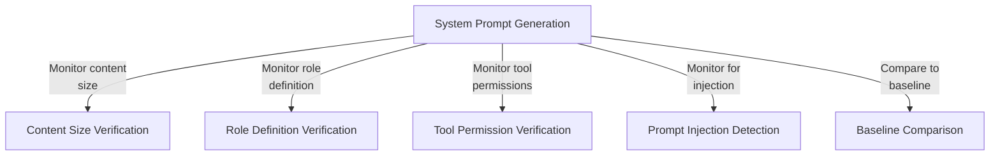

# Mode Configuration Architecture Analysis

## Executive Summary

This document analyzes Roo Code's mode switching and system prompt management architecture, identifying potential monitoring integration points for detecting anomalies. The analysis reveals a sophisticated system that combines built-in and custom modes, with flexible prompt generation that can be overridden through files. Several monitoring integration points are identified for detecting anomalies in prompt application and mode transitions.

## 1. Architectural Overview

### 1.1 Mode Management Architecture



### 1.2 Key Components

1. **Mode Definition Sources**
   - Built-in modes: Defined in `shared/modes.ts`
   - Custom modes: Defined in `.roomodes` file (project-specific) or global settings

2. **Mode Management**
   - `CustomModesManager`: Loads, merges, and caches mode configurations
   - Project modes take precedence over global modes

3. **Mode Switching**
   - `switchModeTool`: Tool for requesting mode switches
   - `ClineProvider.handleModeSwitch`: Performs the actual mode switch
   - Updates global state, API configuration, and webview state

4. **System Prompt Generation**
   - `SYSTEM_PROMPT`: Main function for constructing system prompts
   - Checks for file-based overrides first
   - Combines various sections to build the final prompt
   - Integrates mode-specific permissions and capabilities

## 2. Mode Configuration Architecture

### 2.1 Mode Definition Structure

Each mode in Roo Code is defined with the following properties:

```typescript
interface ModeConfig {
    slug: string;              // Unique identifier
    name: string;              // Display name (with emoji)
    roleDefinition: string;    // System prompt defining the mode's role
    groups: GroupEntry[];      // Permission groups for tools
    customInstructions?: string; // Additional mode-specific instructions
    source?: "project" | "global"; // Source of the mode definition
}
```

### 2.2 Mode Loading and Precedence

Mode configurations are loaded from multiple sources and merged with a specific precedence:

1. **Project-specific modes** (from `.roomodes`): Highest precedence
2. **Global custom modes** (from global settings): Middle precedence
3. **Built-in modes** (from `modes.ts`): Lowest precedence

The `CustomModesManager` handles loading from these sources and merging them appropriately:

```typescript
// Pseudocode for mode merging logic
function mergeCustomModes(projectModes, globalModes) {
    const merged = [];
    const slugs = new Set();
    
    // Add project modes first (higher precedence)
    for (const mode of projectModes) {
        if (!slugs.has(mode.slug)) {
            slugs.add(mode.slug);
            merged.push({...mode, source: "project"});
        }
    }
    
    // Add non-duplicate global modes
    for (const mode of globalModes) {
        if (!slugs.has(mode.slug)) {
            slugs.add(mode.slug);
            merged.push({...mode, source: "global"});
        }
    }
    
    return merged;
}
```

### 2.3 Mode Group Permissions

Each mode has a set of permission groups that determine which tools it can use:

- `read`: File reading operations
- `edit`: File editing operations (can be restricted with regex patterns)
- `browser`: Browser interaction tools
- `command`: Command execution tools
- `mcp`: Model Context Protocol tools

This permissions system ensures that each mode only has access to appropriate tools, enhancing security and task specialization.

## 3. System Prompt Management

### 3.1 Prompt Generation Process

System prompts are generated through a multi-step process:

1. Check if a file-based override exists for the current mode
2. If an override exists, use it along with the role definition
3. Otherwise, dynamically generate the prompt by combining multiple components:
   - Role definition (from mode config)
   - Markdown formatting section
   - Tool descriptions specific to the mode
   - Tool use guidelines
   - MCP servers section (if applicable)
   - Capabilities section
   - Modes section
   - Rules section
   - System info section
   - Objective section
   - Custom instructions

### 3.2 Code Flow for Prompt Generation



### 3.3 System Prompt Overrides

System prompts can be overridden through files in the workspace. The `getSystemPromptFilePath` function determines the path for a mode-specific system prompt file, and `loadSystemPromptFile` loads the content if it exists.

This override mechanism provides flexibility for workspace-specific customization of modes without modifying the core codebase.

## 4. Mode Switching Implementation

### 4.1 User Interface Flow

1. User requests mode switch through the `switch_mode` tool
2. System asks for user approval
3. Upon approval, `ClineProvider.handleModeSwitch` is called
4. The mode state is updated
5. Mode-specific API configuration is loaded
6. UI is updated to reflect the new mode

### 4.2 State Management During Mode Switching

Mode switching involves updating several state components:

1. Global state: Updated with the new mode slug
2. API configuration: Loaded based on mode-specific settings
3. Telemetry: Mode switch is captured for analytics
4. UI state: Posted to the webview to update the interface

## 5. Monitoring Integration Points

Based on the architecture analysis, the following integration points are recommended for monitoring mode transitions and detecting anomalies in prompt application:

### 5.1 Mode Switching Monitoring



#### Integration Points:

1. **Pre-Switch Verification**
   - Location: `switchModeTool.ts`
   - Implementation: Add validation checks before mode switching to ensure the target mode exists and is valid
   - Monitoring: Log attempted switches to invalid modes

2. **Mode Transition Events**
   - Location: `ClineProvider.handleModeSwitch`
   - Implementation: Enhance existing telemetry with before/after state comparisons
   - Monitoring: Detect unusual mode transition patterns

### 5.2 System Prompt Application Monitoring



#### Integration Points:

1. **System Prompt Construction Hook**
   - Location: `system.ts` (in the `SYSTEM_PROMPT` function)
   - Implementation: Add hooks to monitor the generated system prompt content
   - Monitoring: Detect anomalies in prompt structure, size, or content

2. **Role Definition Validation**
   - Location: `SYSTEM_PROMPT` function
   - Implementation: Validate that role definitions match expected patterns
   - Monitoring: Detect unauthorized modifications to role definitions

3. **Tool Permission Verification**
   - Location: `getToolDescriptionsForMode` function
   - Implementation: Verify tool permissions match the expected mode configuration
   - Monitoring: Alert on unexpected tool permission changes

4. **File-based Override Validation**
   - Location: `loadSystemPromptFile` function
   - Implementation: Add validation for file-based system prompt overrides
   - Monitoring: Log and alert on suspicious file-based overrides

5. **Prompt Injection Detection**
   - Location: `system.ts`
   - Implementation: Add patterns to detect potential prompt injection attempts
   - Monitoring: Alert on suspicious content in system prompts

### 5.3 Implementation Recommendations

#### 1. Extend Telemetry Service

```typescript
// Example extension to TelemetryService
class TelemetryService {
  // Existing methods...
  
  public captureSystemPromptGeneration(
    taskId: string, 
    mode: string, 
    promptSize: number, 
    hasFileOverride: boolean
  ): void {
    this.captureEvent(PostHogClient.EVENTS.TASK.SYSTEM_PROMPT_GENERATED, {
      taskId,
      mode,
      promptSize,
      hasFileOverride
    });
  }
  
  public captureSystemPromptAnomaly(
    taskId: string,
    mode: string,
    anomalyType: string,
    details: any
  ): void {
    this.captureEvent(PostHogClient.EVENTS.ANOMALIES.SYSTEM_PROMPT_ANOMALY, {
      taskId,
      mode,
      anomalyType,
      details
    });
  }
}
```

#### 2. Add Prompt Validation Layer

```typescript
// Pseudocode for system prompt validation
function validateSystemPrompt(prompt: string, mode: string): ValidationResult {
  const validationResult: ValidationResult = { valid: true, issues: [] };
  
  // Size validation
  if (prompt.length > MAX_PROMPT_SIZE || prompt.length < MIN_PROMPT_SIZE) {
    validationResult.valid = false;
    validationResult.issues.push({
      type: "size",
      detail: `Prompt size ${prompt.length} outside expected range`
    });
  }
  
  // Role definition validation
  if (!prompt.includes(getExpectedRoleDefinition(mode))) {
    validationResult.valid = false;
    validationResult.issues.push({
      type: "role_definition",
      detail: "Role definition does not match expected pattern"
    });
  }
  
  // Pattern-based injection detection
  for (const pattern of INJECTION_PATTERNS) {
    if (pattern.test(prompt)) {
      validationResult.valid = false;
      validationResult.issues.push({
        type: "potential_injection",
        detail: `Matched suspicious pattern: ${pattern}`
      });
    }
  }
  
  return validationResult;
}
```

#### 3. Add Mode Transition Monitoring

```typescript
// Pseudocode for mode transition monitoring
function monitorModeTransition(
  fromMode: string, 
  toMode: string, 
  userRequested: boolean
): void {
  // Log the transition
  logger.info("Mode transition", { fromMode, toMode, userRequested });
  
  // Check against unusual patterns
  const isUnusualTransition = unusualTransitionPatterns.some(
    pattern => pattern.from === fromMode && pattern.to === toMode
  );
  
  if (isUnusualTransition) {
    logger.warn("Unusual mode transition detected", { fromMode, toMode });
    telemetryService.captureEvent("Unusual Mode Transition", {
      fromMode,
      toMode,
      userRequested
    });
  }
  
  // Track frequency of transitions
  updateTransitionFrequency(fromMode, toMode);
}
```

## 6. Conclusion

Roo Code's mode configuration architecture provides a flexible system for defining specialized agent modes with different capabilities and permissions. The system prompt management allows for both dynamic generation and file-based overrides, enabling customization while maintaining core functionality.

The identified monitoring integration points provide opportunities to detect anomalies in both mode transitions and system prompt application. By implementing these monitoring capabilities, Roo Code can enhance its security posture and ensure the integrity of its mode-based design.

By leveraging the existing telemetry infrastructure and adding targeted validation layers, these enhancements can be integrated with minimal changes to the core architecture while providing valuable safeguards against potential prompt manipulation or unexpected behavior.