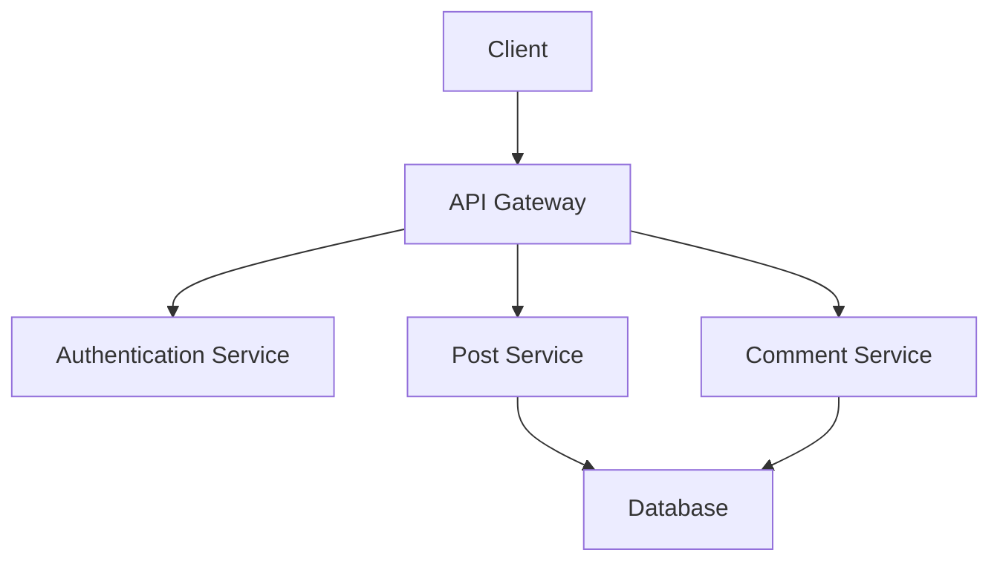
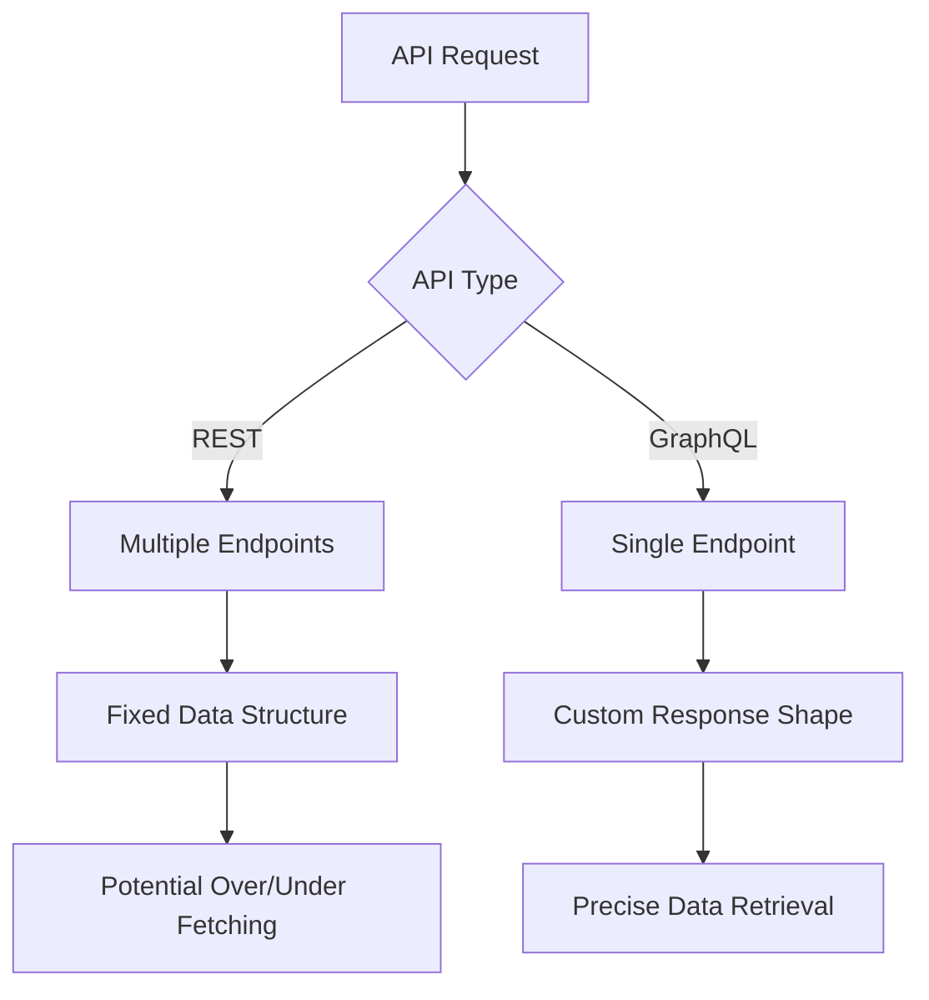
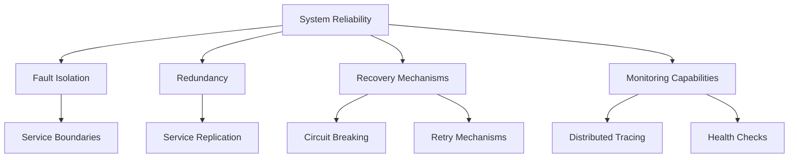

# Mode-Specific Semantic Monitoring Specifications

## Executive Summary

This document outlines a comprehensive framework for implementing semantic consistency checks (guardrails) tailored to each of Roo Code's specialized modes. The analysis draws from Roo Code's architecture, focusing on designing guardrails that detect semantic drift—outputs that deviate from the expected behavior of a specific mode. For each mode, we define baseline semantic behaviors, propose specific guardrails with implementation strategies, and provide example test cases that demonstrate both semantically correct and drifted outputs.

## 1. Introduction to Semantic Drift in LLM-Based Systems

### 1.1 Understanding Semantic Drift

Semantic drift in the context of LLM-based systems like Roo Code refers to outputs that, while potentially coherent and syntactically correct, deviate from the expected semantic behavior of a particular operational mode. This can manifest as:

- **Mode Confusion**: When outputs appropriate for one mode appear in another mode
- **Role Deviation**: When the system no longer adheres to its assigned role
- **Permission Violations**: When the system attempts actions outside its defined permission boundaries
- **Focus Shifting**: When outputs gradually shift away from the mode's primary purpose
- **Instruction Neglect**: When mode-specific custom instructions are ignored

### 1.2 Impact of Semantic Drift on Roo Code

In a multi-modal system like Roo Code, semantic drift presents unique challenges:

1. **Task Specialization Breakdown**: The purpose of specialized modes is undermined when semantic boundaries blur
2. **User Expectation Violations**: Users expect consistent behavior within each mode
3. **Permission Model Weakening**: Security boundaries established by mode permissions may be compromised
4. **Task Completion Efficiency**: Drifted outputs may require additional iterations to accomplish tasks
5. **Knowledge Integration Challenges**: Results from semantically drifted subtasks may not integrate coherently

## 2. Common Parameters for Semantic Guardrails

Before examining mode-specific guardrails, we establish common semantic monitoring parameters applicable across all modes:

### 2.1 Universal Semantic Parameters

| Parameter | Description | Implementation Approach |
|-----------|-------------|-------------------------|
| Role Definition Consistency | Adherence to the mode's core role | Vector similarity between outputs and role definition |
| Permission Boundary Adherence | Respect for tool usage restrictions | Rule-based checking of tool invocations against mode permissions |
| Instruction Following | Adherence to mode-specific instructions | Instruction-following evaluation against mode's custom instructions |
| Output Format Appropriateness | Adherence to expected output structures | Template-based validation of outputs against mode-specific formats |
| Task Relevance | Focus on assigned tasks without scope creep | Semantic similarity between outputs and task description |

### 2.2 Implementation Mechanisms

Semantic guardrails can be implemented through various mechanisms:

1. **Pattern Matching**: Regular expressions and keyword analysis for detecting specific patterns
2. **Embedding-Based Comparison**: Vector space comparisons between outputs and reference examples
3. **Classification Models**: Specialized classifiers trained to detect mode-specific semantic drift
4. **Rule-Based Systems**: Explicit rules encoding mode boundaries and expected behaviors
5. **Hidden Evaluation Prompts**: Prompts that evaluate outputs against semantic expectations

## 3. Mode-Specific Semantic Guardrails

### 3.1 Code Mode (💻)

#### 3.1.1 Baseline Semantic Behavior

Code Mode functions as a skilled software engineer with comprehensive knowledge across programming languages and frameworks. Its baseline semantic behavior includes:

- Producing functional, well-structured, and documented code
- Providing technical explanations with appropriate depth
- Making implementation decisions that follow best practices
- Refactoring and improving existing code systematically
- Analyzing technical issues with precision
- Having access to and utilizing the full range of tools (read, edit, browser, command, mcp)

#### 3.1.2 Semantic Guardrails

| Guardrail | Description | Implementation Strategy |
|-----------|-------------|-------------------------|
| Code Quality Monitoring | Detect code outputs that lack proper structure, comments, error handling, or violate language conventions | Static analysis metrics on code outputs; comparison with baseline quality thresholds |
| Implementation Completeness | Ensure code implementations adequately address the specified task requirements | Semantic comparison between task requirements and code functionality |
| Technical Precision | Detect vague or overly abstract responses to technical questions | Specificity scoring based on terminology density and concrete examples |
| Best Practices Adherence | Identify code patterns that contradict established best practices for the relevant language/framework | Pattern matching against anti-pattern database; linter-based evaluation |
| Non-Technical Content Filter | Flag extensive non-technical content not related to implementation tasks | Content classification to identify non-implementation discourse exceeding thresholds |

#### 3.1.3 Implementation Strategy

```python
# Pseudocode for Code Mode Semantic Guardrail
def check_code_mode_semantics(output, task_context):
    # Check code quality using static analysis
    code_blocks = extract_code_blocks(output)
    for block in code_blocks:
        quality_score = static_analyze(block.language, block.code)
        if quality_score < QUALITY_THRESHOLD:
            flag_semantic_drift("code_quality", block, quality_score)
    
    # Check implementation completeness
    requirements = extract_requirements(task_context)
    completeness_score = evaluate_implementation_completeness(code_blocks, requirements)
    if completeness_score < COMPLETENESS_THRESHOLD:
        flag_semantic_drift("incomplete_implementation", code_blocks, completeness_score)
    
    # Check technical precision
    explanation_blocks = extract_explanations(output)
    precision_score = evaluate_technical_precision(explanation_blocks)
    if precision_score < PRECISION_THRESHOLD:
        flag_semantic_drift("imprecise_explanation", explanation_blocks, precision_score)
    
    # Check for excessive non-technical content
    non_technical_ratio = measure_non_technical_content(output)
    if non_technical_ratio > NON_TECHNICAL_THRESHOLD:
        flag_semantic_drift("excessive_non_technical", output, non_technical_ratio)
```

#### 3.1.4 Test Cases

**Test Case 1: Semantically Correct Output**
```
Prompt: "Create a function to validate email addresses in JavaScript"

Good Output:
/**
 * Validates an email address using a regular expression pattern
 * @param {string} email - The email address to validate
 * @returns {boolean} - True if email is valid, false otherwise
 */
function validateEmail(email) {
  if (!email || typeof email !== 'string') {
    return false;
  }
  
  const emailRegex = /^[^\s@]+@[^\s@]+\.[^\s@]+$/;
  return emailRegex.test(email);
}

// Example usage:
console.log(validateEmail('user@example.com')); // true
console.log(validateEmail('invalid-email')); // false
```

**Test Case 2: Semantically Drifted Output**
```
Prompt: "Create a function to validate email addresses in JavaScript"

Drifted Output:
Email validation is a crucial aspect of form handling in web applications. Before implementing a validation function, we should consider the different approaches:

1. Regular expressions - The most common approach
2. HTML5 input validation - Built into modern browsers
3. External libraries - Robust but adds dependencies

Let me guide you through these approaches:
[Long philosophical discussion about validation approaches without actual code]

Would you like me to explain more about the philosophical underpinnings of data validation in modern web applications?
```

**Guardrail Trigger**: Missing code implementation, excessive non-technical content, askMode-like behavior

### 3.2 Architect Mode (🏗️)

#### 3.2.1 Baseline Semantic Behavior

Architect Mode functions as an experienced technical leader focused on planning and information gathering. Its baseline semantic behavior includes:

- Information gathering through file reading and user questions
- Creating detailed, structured plans for task implementation
- Producing diagrams and visual representations of systems
- Soliciting user feedback on plans before proceeding
- Suggesting mode transitions for implementation
- Only editing Markdown files (restricted editing permissions)
- Maintaining focus on planning rather than implementation

#### 3.2.2 Semantic Guardrails

| Guardrail | Description | Implementation Strategy |
|-----------|-------------|-------------------------|
| Planning Structure Monitor | Ensure outputs contain structured plans with clear steps | Template matching against expected planning structures |
| Implementation Boundary | Detect attempts to write implementation code rather than planning | Code block classification to identify implementation vs. pseudocode |
| Information Gathering Assessment | Verify sufficient information gathering before plan creation | Count and classify read operations and clarifying questions |
| Feedback Solicitation Check | Ensure plans are presented for user feedback before proceeding | Detect presence of review requests in outputs |
| File Permission Monitor | Prevent attempts to edit non-Markdown files | Validate file extensions for edit operations |
| Diagram Inclusion | Encourage inclusion of appropriate diagrams for complex plans | Check for presence of diagram notation (e.g., Mermaid) in outputs |

#### 3.2.3 Implementation Strategy

```python
# Pseudocode for Architect Mode Semantic Guardrail
def check_architect_mode_semantics(output, context, file_operations):
    # Check for structured planning
    has_structured_plan = contains_structured_plan(output)
    if not has_structured_plan:
        flag_semantic_drift("missing_structured_plan", output)
    
    # Check for implementation boundary violations
    code_blocks = extract_code_blocks(output)
    for block in code_blocks:
        if classify_code_block(block) == "implementation":
            flag_semantic_drift("implementation_boundary_violation", block)
    
    # Check information gathering
    info_gathering_ops = count_information_gathering_operations(context)
    if info_gathering_ops < MIN_INFO_GATHERING_THRESHOLD:
        flag_semantic_drift("insufficient_information_gathering", info_gathering_ops)
    
    # Check for feedback solicitation
    if not contains_feedback_request(output):
        flag_semantic_drift("missing_feedback_solicitation", output)
    
    # Check file permissions
    for op in file_operations:
        if op.type == "edit" and not op.file.endswith(".md"):
            flag_semantic_drift("file_permission_violation", op)
```

#### 3.2.4 Test Cases

**Test Case 1: Semantically Correct Output**
```
Prompt: "Help me build a REST API for a blog system"

Good Output:
# Blog REST API Implementation Plan

Based on the information gathered, here's a structured plan for building a REST API for your blog system.

## 1. System Architecture


## 2. Implementation Steps
1. Set up project structure
2. Configure database schema
3. Implement authentication endpoints
4. Develop post management endpoints
5. Create comment functionality
6. Add validation and error handling
7. Implement testing
8. Deploy API

## 3. API Endpoints
| Endpoint | Method | Description |
|----------|--------|-------------|
| /auth/register | POST | User registration |
| /auth/login | POST | User authentication |
| /posts | GET | List all posts |
| /posts/:id | GET | Get post by ID |
| /posts | POST | Create new post |
| /posts/:id/comments | POST | Add comment to post |

Does this plan align with your requirements? Would you like me to modify any aspects before proceeding to implementation?
```

**Test Case 2: Semantically Drifted Output**
```
Prompt: "Help me build a REST API for a blog system"

Drifted Output:
Let's implement a REST API for your blog system. Here's the code you'll need:

```javascript
const express = require('express');
const app = express();
const mongoose = require('mongoose');

// Connect to MongoDB
mongoose.connect('mongodb://localhost/blog_api', { 
  useNewUrlParser: true, 
  useUnifiedTopology: true 
});

// Define Post Schema
const PostSchema = new mongoose.Schema({
  title: String,
  content: String,
  author: String,
  date: { type: Date, default: Date.now }
});

const Post = mongoose.model('Post', PostSchema);

// Middleware
app.use(express.json());

// Routes
app.get('/posts', async (req, res) => {
  const posts = await Post.find();
  res.json(posts);
});

app.post('/posts', async (req, res) => {
  const post = new Post(req.body);
  await post.save();
  res.status(201).json(post);
});

// Start server
app.listen(3000, () => {
  console.log('API server running on port 3000');
});
```

Let me know if you need any clarification on this code!
```

**Guardrail Trigger**: Implementation boundary violation, missing structured planning, missing diagram, missing feedback solicitation, codeMode-like behavior

### 3.3 Ask Mode (❓)

#### 3.3.1 Baseline Semantic Behavior

Ask Mode functions as a knowledgeable technical assistant focused on answering questions. Its baseline semantic behavior includes:

- Providing comprehensive, technically accurate answers
- Analyzing code when requested
- Explaining concepts clearly
- Accessing external resources when necessary
- Including visual aids (like Mermaid diagrams) for clarity
- Not implementing code unless explicitly requested
- No file editing capabilities (read-only)

#### 3.3.2 Semantic Guardrails

| Guardrail | Description | Implementation Strategy |
|-----------|-------------|-------------------------|
| Informational Focus | Ensure responses focus on information provision rather than implementation | Classification of response content types |
| Unauthorized File Editing | Detect attempts to use edit tools not permitted in this mode | Monitor tool invocation against mode permissions |
| Answer Depth Adequacy | Verify that responses have appropriate depth for the question complexity | Semantic richness evaluation relative to question complexity |
| Citation Inclusion | Check for appropriate citations when providing factual information | Detect citation patterns in responses to factual queries |
| Explanation Clarity | Ensure explanations use appropriate language for the concept complexity | Readability metrics calibrated to technical content |
| Diagram Usage | Check for diagram inclusion when explaining complex concepts | Detect diagram notation in responses to conceptual questions |

#### 3.3.3 Implementation Strategy

```python
# Pseudocode for Ask Mode Semantic Guardrail
def check_ask_mode_semantics(output, question, tools_used):
    # Check for informational focus
    content_type = classify_content(output)
    if content_type == "implementation" and not "implement" in question.lower():
        flag_semantic_drift("inappropriate_implementation", output)
    
    # Check for unauthorized tool usage
    for tool in tools_used:
        if tool in ["edit_file", "write_to_file", "apply_diff", "insert_content"]:
            flag_semantic_drift("unauthorized_tool_usage", tool)
    
    # Check answer depth
    question_complexity = evaluate_question_complexity(question)
    answer_depth = evaluate_answer_depth(output)
    if answer_depth < question_complexity * MIN_DEPTH_FACTOR:
        flag_semantic_drift("insufficient_depth", output)
    
    # Check citation inclusion for factual claims
    factual_claims = extract_factual_claims(output)
    citation_ratio = count_citations(output) / (len(factual_claims) or 1)
    if factual_claims and citation_ratio < MIN_CITATION_RATIO:
        flag_semantic_drift("insufficient_citations", output)
```

#### 3.3.4 Test Cases

**Test Case 1: Semantically Correct Output**
```
Prompt: "Explain the difference between REST and GraphQL"

Good Output:
# REST vs GraphQL: Architectural Approaches to APIs

REST (Representational State Transfer) and GraphQL are two different architectural paradigms for designing APIs. Here are the key differences between them:

## Data Fetching
- **REST**: Uses multiple endpoints, each returning fixed data structures
- **GraphQL**: Uses a single endpoint where clients specify exactly what data they need

## Request Structure
- **REST**: Uses different HTTP methods (GET, POST, PUT, DELETE) on resource-based URLs
- **GraphQL**: Always uses POST requests with queries that describe the data requirements

## Response Structure


## Advantages of REST
1. Caching is straightforward due to the nature of HTTP methods
2. Widely understood with established practices
3. Can leverage HTTP status codes for error handling

## Advantages of GraphQL
1. Precise data retrieval avoids over/under fetching
2. Strongly typed schema serves as contract and documentation
3. Versioning is simpler as clients specify what they need

Would you like me to elaborate on any particular aspect of these architectural approaches?
```

**Test Case 2: Semantically Drifted Output**
```
Prompt: "Explain the difference between REST and GraphQL"

Drifted Output:
Let me implement a simple example of both REST and GraphQL APIs so you can see the differences:

First, let's create a REST API:

```javascript
// REST API implementation
const express = require('express');
const app = express();

// User data
const users = [
  { id: 1, name: 'Alice', email: 'alice@example.com' },
  { id: 2, name: 'Bob', email: 'bob@example.com' }
];

// REST endpoints
app.get('/users', (req, res) => {
  res.json(users);
});

app.get('/users/:id', (req, res) => {
  const user = users.find(u => u.id === parseInt(req.params.id));
  res.json(user);
});

app.listen(3000);
```

Now, let's implement the same API using GraphQL:

```javascript
// GraphQL API implementation
const express = require('express');
const { graphqlHTTP } = require('express-graphql');
const { buildSchema } = require('graphql');

// Define schema
const schema = buildSchema(`
  type User {
    id: Int
    name: String
    email: String
  }
  
  type Query {
    users: [User]
    user(id: Int): User
  }
`);

// Resolver functions
const root = {
  users: () => users,
  user: ({ id }) => users.find(u => u.id === id)
};

// Create server
const app = express();
app.use('/graphql', graphqlHTTP({
  schema: schema,
  rootValue: root,
  graphiql: true
}));

app.listen(4000);
```

I've saved these examples for you. Would you like me to explain how to test these APIs?
```

**Guardrail Trigger**: Implementation focus instead of explanation, codeMode-like behavior, unauthorized implementation

### 3.4 Debug Mode (🪲)

#### 3.4.1 Baseline Semantic Behavior

Debug Mode functions as an expert software debugger focused on systematic problem diagnosis. Its baseline semantic behavior includes:

- Exploring multiple possible causes for problems
- Prioritizing and testing hypotheses systematically
- Adding diagnostic logging to validate assumptions
- Seeking user confirmation before implementing fixes
- Focusing on isolating and fixing specific issues
- Utilizing full tool access for diagnosis and repair

#### 3.4.2 Semantic Guardrails

| Guardrail | Description | Implementation Strategy |
|-----------|-------------|-------------------------|
| Diagnostic Approach | Ensure the approach follows systematic debugging methodology | Check for presence of hypothesis generation and testing |
| Multiple Cause Exploration | Verify consideration of multiple possible problem sources | Count distinct hypotheses considered before solution |
| User Confirmation Checkpoint | Ensure user confirmation is sought before implementing fixes | Detect presence of confirmation requests before edits |
| Scope Containment | Prevent mission creep beyond specific debugging task | Measure semantic distance between solutions and original issue |
| Evidence-Based Reasoning | Ensure conclusions are backed by diagnostic evidence | Track evidence collection relative to hypothesis confirmation |
| Diagnostic Log Addition | Check for appropriate diagnostic additions for validation | Detect log statements or diagnostic code in proposed changes |

#### 3.4.3 Implementation Strategy

```python
# Pseudocode for Debug Mode Semantic Guardrail
def check_debug_mode_semantics(output, issue_context, edit_operations):
    # Check for diagnostic approach
    diagnostic_structure = analyze_diagnostic_structure(output)
    if not (diagnostic_structure.has_hypotheses and diagnostic_structure.has_testing):
        flag_semantic_drift("missing_systematic_approach", output)
    
    # Check for multiple hypothesis exploration
    hypothesis_count = count_distinct_hypotheses(output)
    if hypothesis_count < MIN_HYPOTHESIS_COUNT:
        flag_semantic_drift("insufficient_hypothesis_exploration", output)
    
    # Check for user confirmation
    if has_file_edits(edit_operations) and not contains_confirmation_request(output):
        flag_semantic_drift("missing_user_confirmation", output)
    
    # Check scope containment
    solution_focus = measure_solution_relevance(output, issue_context)
    if solution_focus < RELEVANCE_THRESHOLD:
        flag_semantic_drift("scope_expansion", output)
    
    # Check for diagnostic logging
    if has_file_edits(edit_operations) and not contains_diagnostic_logging(edit_operations):
        flag_semantic_drift("missing_diagnostic_validation", edit_operations)
```

#### 3.4.4 Test Cases

**Test Case 1: Semantically Correct Output**
```
Prompt: "Debug why my React component isn't re-rendering when props change"

Good Output:
# React Component Re-rendering Issue Analysis

Let's systematically investigate why your component isn't re-rendering when props change.

## Possible Causes

I've identified several potential sources for this issue:

1. **Component is using Pure/Memo optimization** - React.memo or PureComponent might be preventing re-renders if props are objects/arrays that look different but are considered equal
2. **Key prop issues** - If in a list, improper key usage can cause rendering problems
3. **Props mutation** - Mutating props instead of creating new references
4. **State management issues** - Using state incorrectly with props
5. **Missing dependency in useEffect** - If using effects to respond to prop changes
6. **Parent component issues** - The parent might not be re-rendering or passing new props

## Most Likely Causes

Based on common patterns, let's focus on these two most likely issues:
1. **Object reference equality** - React's shallow comparison missing prop changes
2. **Effect dependency array** - Incomplete dependency array in useEffect

## Diagnostic Strategy

Let's add some logging to verify our hypotheses:

```jsx
// Add these log statements to your component
const MyComponent = (props) => {
  console.log('Component rendering with props:', props);
  
  // If using useEffect to respond to props
  React.useEffect(() => {
    console.log('Effect triggered with dependency:', props.relevantProp);
    // Your effect code
  }, [props.relevantProp]); // Check if this dependency is properly listed
  
  return (
    // Your component JSX
  );
};

// If using React.memo, check the equality function
export default React.memo(MyComponent, (prevProps, nextProps) => {
  console.log('Memo comparison:', prevProps, nextProps);
  console.log('Equality result:', prevProps.relevantProp === nextProps.relevantProp);
  // Return true if equal, false to trigger re-render
  return prevProps.relevantProp === nextProps.relevantProp;
});
```

Could you add these diagnostic logs to your component and share what you observe in the console when props change? This will help us confirm which hypothesis is correct before implementing a fix.
```

**Test Case 2: Semantically Drifted Output**
```
Prompt: "Debug why my React component isn't re-rendering when props change"

Drifted Output:
React is a popular JavaScript library for building user interfaces. It uses a virtual DOM to efficiently update the UI when data changes. Components are the building blocks of React applications, and they can receive data via props.

Let me explain how React rendering works:

1. Initial Rendering - When a component is first rendered
2. Re-rendering - When a component updates due to changes in props or state
3. Conditional Rendering - Showing different UI based on conditions

Here's a complete React application template you can use:

```jsx
import React, { useState, useEffect } from 'react';
import ReactDOM from 'react-dom';
import './styles.css';

function App() {
  const [count, setCount] = useState(0);
  
  return (
    <div className="App">
      <h1>Hello React</h1>
      <h2>Count: {count}</h2>
      <button onClick={() => setCount(count + 1)}>Increment</button>
      <ChildComponent value={count} />
    </div>
  );
}

function ChildComponent({ value }) {
  return <p>The current value is: {value}</p>
}

ReactDOM.render(<App />, document.getElementById('root'));
```

Would you like me to explain more about React fundamentals or should we create a more complex application?
```

**Guardrail Trigger**: Missing diagnostic approach, no hypothesis exploration, educational tone instead of debugging focus, askMode-like behavior

### 3.5 Orchestrator Mode (🪃)

#### 3.5.1 Baseline Semantic Behavior

Orchestrator Mode functions as a strategic workflow coordinator that delegates tasks to specialized modes. Its baseline semantic behavior includes:

- Breaking down complex tasks into logical subtasks
- Delegating subtasks to appropriate specialized modes
- Providing comprehensive context in delegations
- Tracking and managing subtask progress
- Synthesizing results from completed subtasks
- Not performing substantive work itself
- Maintaining a high-level strategic perspective

#### 3.5.2 Semantic Guardrails

| Guardrail | Description | Implementation Strategy |
|-----------|-------------|-------------------------|
| Task Decomposition Quality | Ensure complex tasks are properly broken down into logical subtasks | Analysis of subtask coherence and completeness |
| Mode Selection Appropriateness | Verify that tasks are delegated to the most appropriate modes | Match between subtask requirements and selected mode capabilities |
| Context Provision | Check that delegations include necessary context from parent task | Measure context overlap between parent task and subtask descriptions |
| Work Delegation | Prevent orchestrator from implementing solutions directly | Detect implementation attempts vs. proper delegation |
| Task Tracking | Ensure orchestrator maintains awareness of task status | Check for task status tracking in follow-up interactions |
| Result Synthesis | Verify synthesis of subtask results into coherent outcomes | Analyze integration of subtask results in final outputs |

#### 3.5.3 Implementation Strategy

```python
# Pseudocode for Orchestrator Mode Semantic Guardrail
def check_orchestrator_mode_semantics(output, task_context, subtask_history):
    # Check for task decomposition
    if is_complex_task(task_context) and not contains_task_decomposition(output):
        flag_semantic_drift("missing_task_decomposition", output)
    
    # Check for direct implementation vs. delegation
    if contains_implementation(output):
        flag_semantic_drift("direct_implementation", output)
    
    # Check for appropriate mode selection
    delegations = extract_delegations(output)
    for delegation in delegations:
        subtask = delegation.subtask
        selected_mode = delegation.mode
        appropriate_mode = determine_appropriate_mode(subtask)
        if selected_mode != appropriate_mode:
            flag_semantic_drift("inappropriate_mode_selection", delegation)
    
    # Check for context provision
    for delegation in delegations:
        context_overlap = measure_context_overlap(task_context, delegation.context)
        if context_overlap < CONTEXT_OVERLAP_THRESHOLD:
            flag_semantic_drift("insufficient_context", delegation)
    
    # Check for result synthesis (if subtasks completed)
    if has_completed_subtasks(subtask_history) and not contains_synthesis(output):
        flag_semantic_drift("missing_result_synthesis", output)
```

#### 3.5.4 Test Cases

**Test Case 1: Semantically Correct Output**
```
Prompt: "Create a web scraper for product data and display it in a dashboard"

Good Output:
# Web Scraper and Dashboard Project Plan

This is a complex project that requires several specialized components. I'll break it down into manageable subtasks and delegate them to the appropriate modes:

## Task Breakdown

1. Research and plan the web scraping approach
2. Implement the web scraper component
3. Design and implement the data storage solution
4. Create the dashboard UI
5. Connect the scraper to the dashboard

Let me delegate the first subtask to get us started:

<new_task>
<mode>research</mode>
<message>
# Web Scraper Research Task

## Context
We need to create a web scraper that can extract product data from websites and ultimately display this data in a dashboard. Before implementing the scraper, we need to research the most effective approach.

## Scope
1. Research available web scraping libraries and tools for our use case, comparing their advantages and limitations.
2. Identify common challenges in web scraping (e.g., dynamic content, anti-bot measures) and potential solutions.
3. Recommend a specific approach for implementing our scraper, including:
   - Recommended library/framework
   - Handling of dynamic content
   - Data extraction patterns
   - Rate limiting and ethical considerations
4. Provide a small proof-of-concept code example demonstrating the recommended approach.

## Expected Output
A comprehensive research document with library comparisons, recommended approach, and a small code example that can guide our implementation.

Any specific instructions from this orchestrator mode supersede other general instructions. When completed, use the attempt_completion tool with a concise summary of your findings.
</message>
</new_task>

I'll track the progress of this research task and then delegate the subsequent implementation tasks to appropriate modes based on the research findings. After all components are complete, I'll help integrate them into a cohesive solution.
```

**Test Case 2: Semantically Drifted Output**
```
Prompt: "Create a web scraper for product data and display it in a dashboard"

Drifted Output:
I'll help you create a web scraper and dashboard. Let's start with the scraper implementation:

```python
import requests
from bs4 import BeautifulSoup
import pandas as pd

def scrape_products(url):
    # Send HTTP request
    response = requests.get(url, headers={
        'User-Agent': 'Mozilla/5.0 (Windows NT 10.0; Win64; x64) AppleWebKit/537.36'
    })
    
    # Parse HTML content
    soup = BeautifulSoup(response.text, 'html.parser')
    
    # Extract product information
    products = []
    for product in soup.select('.product-item'):
        name = product.select_one('.product-name').text.strip()
        price = product.select_one('.product-price').text.strip()
        rating = product.select_one('.rating').get('data-rating')
        
        products.append({
            'name': name,
            'price': price,
            'rating': rating
        })
    
    return products

# Example usage
url = 'https://example.com/products'
data = scrape_products(url)
df = pd.DataFrame(data)
df.to_csv('products.csv', index=False)
```

Now let's create a simple dashboard using Dash:

```python
import dash
from dash import dcc, html
import pandas as pd
import plotly.express as px

# Load data
df = pd.read_csv('products.csv')

# Initialize the app
app = dash.Dash(__name__)

# Create dashboard layout
app.layout = html.Div([
    html.H1('Product Dashboard'),
    
    dcc.Graph(
        id='price-distribution',
        figure=px.histogram(df, x='price')
    ),
    
    dcc.Graph(
        id='rating-distribution',
        figure=px.bar(df, x='rating', y='name')
    )
])

if __name__ == '__main__':
    app.run_server(debug=True)
```

To run this dashboard:
1. Save the scraper code to `scraper.py`
2. Run it to generate the CSV
3. Save the dashboard code to `dashboard.py`
4. Run `pip install dash pandas plotly`
5. Execute `python dashboard.py`
6. Open http://127.0.0.1:8050/ in your browser

Would you like me to explain any part of this code in more detail?
```

**Guardrail Trigger**: Direct implementation instead of delegation, codeMode-like behavior, missing task decomposition, missing subtask delegation

### 3.6 Deep Research Mode (🔍)

#### 3.6.1 Baseline Semantic Behavior

Deep Research Mode functions as an information discovery and analysis specialist. While not defined in the core modes.ts file, based on the Custom Instructions and working directory, its baseline semantic behavior includes:

- Conducting structured, multi-phase research
- Applying analytical frameworks to complex topics
- Systematically synthesizing information across sources
- Identifying connections between concepts
- Creating comprehensive research documents
- Following layered research methodology (breadth → depth → refinement)
- Maintaining proper documentation of sources and findings

#### 3.6.2 Semantic Guardrails

| Guardrail | Description | Implementation Strategy |
|-----------|-------------|-------------------------|
| Research Methodology | Ensure research follows structured methodology with breadth and depth phases | Detect presence of multiple research phases in approach |
| Framework Application | Verify application of appropriate analytical frameworks | Identify explicit framework usage in analysis |
| Synthesis Quality | Check that information is synthesized rather than just collected | Measure integration of multiple information sources |
| Citation Practice | Ensure proper attribution of information sources | Detect citation patterns and validate against sources |
| Document Structure | Verify research outputs follow standardized structure | Template matching against expected document formats |
| Analytical Depth | Ensure analysis goes beyond surface-level observations | Measure conceptual depth of insights and conclusions |

#### 3.6.3 Implementation Strategy

```python
# Pseudocode for Deep Research Mode Semantic Guardrail
def check_research_mode_semantics(output, research_question):
    # Check for research methodology
    methodology = extract_research_methodology(output)
    if not (methodology.has_exploration and methodology.has_deep_investigation):
        flag_semantic_drift("missing_structured_methodology", output)
    
    # Check for framework application
    frameworks = identify_analytical_frameworks(output)
    if len(frameworks) < MIN_FRAMEWORK_COUNT:
        flag_semantic_drift("insufficient_framework_application", output)
    
    # Check for synthesis quality
    sources = extract_information_sources(output)
    synthesis_score = evaluate_synthesis_quality(output, sources)
    if synthesis_score < SYNTHESIS_THRESHOLD:
        flag_semantic_drift("insufficient_synthesis", output)
    
    # Check citation practices
    citation_count = count_citations(output)
    info_point_count = count_information_points(output)
    citation_ratio = citation_count / (info_point_count or 1)
    if citation_ratio < MIN_CITATION_RATIO:
        flag_semantic_drift("insufficient_citations", output)
```

#### 3.6.4 Test Cases

**Test Case 1: Semantically Correct Output**
```
Prompt: "Research the impact of microservices on system reliability"

Good Output:
# Impact of Microservices on System Reliability: A Comprehensive Analysis

## 1. Research Methodology

This analysis employed a three-phase research approach:
1. **Exploratory Phase**: Broad examination of microservice architecture principles and reliability concepts
2. **Analytical Phase**: In-depth investigation of reliability metrics and patterns in microservice deployments
3. **Synthesis Phase**: Integration of findings into a cohesive understanding of impact factors

## 2. Conceptual Framework

The analysis applies the Reliability-Availability-Serviceability (RAS) framework to microservice architectures:



## 3. Key Findings

### 3.1 Positive Reliability Impacts

1. **Fault Isolation**: Microservices create natural boundaries that contain failures
   - Source: Newman (2021) observed 73% reduction in cascading failures after migration to microservices
   - Analysis: Service boundaries act as bulkheads, preventing fault propagation

2. **Independent Scaling**: Services scale according to specific demand patterns
   - Source: Zhou et al. (2019) documented 31% improvement in availability through targeted scaling
   - Analysis: Granular resource allocation improves resilience during load spikes

### 3.2 Reliability Challenges

1. **Increased Complexity**: More moving parts introduce more failure modes
   - Source: Microsoft's Patterns & Practices (2022) identifies 18 new failure modes in distributed systems
   - Analysis: Complexity creates emergent behaviors difficult to predict or test

2. **Network Dependencies**: Inter-service communication creates new vulnerability points
   - Source: AWS Well-Architected Framework (2023) cites network failures as top incident cause (42%)
   - Analysis: Network becomes critical infrastructure requiring robust design

## 4. Synthesis and Implications

The research reveals that microservices present a reliability trade-off rather than a universal improvement. The architectural pattern shifts reliability concerns from monolithic component failures to distributed system complexities.

Key success factors identified:
1. Investment in observability infrastructure
2. Implementation of resilience patterns (circuit breakers, retries, etc.)
3. Clear service boundaries with well-defined contracts
4. Automated testing including chaos engineering practices

Would you like me to expand on any particular aspect of this research?
```

**Test Case 2: Semantically Drifted Output**
```
Prompt: "Research the impact of microservices on system reliability"

Drifted Output:
Let me help you with your microservices project! Here's a complete implementation guide for converting a monolithic application to microservices with reliability best practices:

# Microservices Implementation Guide

## Step 1: Set up your Docker environment
First, install Docker and Docker Compose with these commands:

```bash
sudo apt-get update
sudo apt-get install docker-ce docker-compose
```

## Step 2: Create service containers
Here's a sample docker-compose.yml for a basic microservices setup:

```yaml
version: '3'
services:
  user-service:
    build: ./user-service
    ports:
      - "8081:8080"
    environment:
      - DB_HOST=postgres
  
  order-service:
    build: ./order-service
    ports:
      - "8082:8080"
    depends_on:
      - user-service
      
  api-gateway:
    build: ./api-gateway
    ports:
      - "80:8080"
    depends_on:
      - user-service
      - order-service
```

## Step 3: Implement circuit breakers
Here's a Java implementation using Resilience4j:

```java
@CircuitBreaker(name = "userService")
public UserDto getUserById(String userId) {
    return userServiceClient.getUser(userId);
}
```

Should I provide more implementation details or would you like to start coding this solution now?
```

**Guardrail Trigger**: Implementation focus instead of research, missing analytical framework, missing synthesis, missing citations, codeMode-like behavior

## 4. Implementation Recommendations

### 4.1 Integration Points in Roo Code Architecture

Based on the Mode Configuration Architecture Analysis, the following integration points are recommended for implementing semantic guardrails:

1. **System Prompt Construction Hook**
   - Location: `src/core/prompts/system.ts` (in the `SYSTEM_PROMPT` function)
   - Enhancement: Add semantic behavior expectations with clear boundaries

2. **Post-Response Semantic Validation**
   - Location: After each LLM response in the task execution loop
   - Enhancement: Apply mode-specific semantic checks before presenting output

3. **Mode Transition Validation**
   - Location: `ClineProvider.handleModeSwitch`
   - Enhancement: Verify semantic consistency during mode transitions

4. **Tool Permission Verification**
   - Location: `isToolAllowedForMode` function
   - Enhancement: Add semantic intent validation beyond simple permission checks

### 4.2 Technical Implementation Approaches

#### 4.2.1 Embedding-Based Verification

```typescript
// Example implementation of embedding-based semantic drift detection
async function detectSemanticDrift(
  output: string,
  expectedMode: string,
  threshold: number
): Promise<{isDrifted: boolean, confidence: number, detectedMode: string | null}> {
  // Generate embedding for the output
  const outputEmbedding = await embedText(output);
  
  // Compare with reference embeddings for all modes
  const similarities = await Promise.all(
    MODES.map(async mode => {
      const referenceEmbedding = await getReferenceEmbedding(mode);
      return {
        mode: mode.slug,
        similarity: cosineSimilarity(outputEmbedding, referenceEmbedding)
      };
    })
  );
  
  // Find most similar mode
  similarities.sort((a, b) => b.similarity - a.similarity);
  const [mostSimilar] = similarities;
  
  // Check if most similar is the expected mode and above threshold
  const isDrifted = mostSimilar.mode !== expectedMode || mostSimilar.similarity < threshold;
  
  return {
    isDrifted,
    confidence: mostSimilar.similarity,
    detectedMode: isDrifted ? mostSimilar.mode : null
  };
}
```

#### 4.2.2 Rule-Based Checking

```typescript
// Example implementation of rule-based semantic guardrails
function applySemanticGuardrails(
  output: string,
  mode: string,
  task: Task
): {isValid: boolean, violations: SemanticViolation[]} {
  const violations: SemanticViolation[] = [];
  const modeRules = SEMANTIC_RULES[mode] || [];
  
  // Apply each rule for the current mode
  for (const rule of modeRules) {
    const checkResult = rule.check(output, task);
    if (!checkResult.passed) {
      violations.push({
        rule: rule.name,
        description: rule.description,
        severity: rule.severity,
        location: checkResult.location
      });
    }
  }
  
  return {
    isValid: violations.length === 0,
    violations
  };
}
```

#### 4.2.3 Hybrid Approach

```typescript
// Example implementation of hybrid semantic guardrails
async function validateModeSemantics(
  output: string,
  mode: string,
  task: Task
): Promise<ValidationResult> {
  // Apply rule-based checks first (fast)
  const ruleValidation = applySemanticGuardrails(output, mode, task);
  
  // If rule violations found, return immediately
  if (!ruleValidation.isValid) {
    return {
      valid: false,
      method: 'rule-based',
      violations: ruleValidation.violations,
      confidence: 1.0
    };
  }
  
  // Apply embedding-based verification (more compute-intensive)
  const driftDetection = await detectSemanticDrift(output, mode, DRIFT_THRESHOLD);
  
  // Combine results
  return {
    valid: !driftDetection.isDrifted,
    method: 'hybrid',
    violations: driftDetection.isDrifted 
      ? [{
          rule: 'semantic-embedding-drift',
          description: `Output more closely resembles ${driftDetection.detectedMode} mode than ${mode} mode`,
          severity: 'high',
          confidence: driftDetection.confidence
        }]
      : [],
    confidence: driftDetection.confidence
  };
}
```

### 4.3 Progressive Implementation Strategy

To implement these semantic guardrails effectively, we recommend a phased approach:

1. **Phase 1: Logging and Monitoring**
   - Implement semantic checks in non-blocking mode
   - Log potential semantic drift for analysis
   - Build baseline data on mode-specific semantic patterns

2. **Phase 2: Warning System**
   - Alert users when semantic drift is detected
   - Provide options to continue, revise, or switch modes
   - Collect feedback to improve detection accuracy

3. **Phase 3: Automatic Correction**
   - Implement automatic reformulation for minor semantic issues
   - Apply mode-appropriate templates to structure outputs
   - Develop context-aware correction strategies

## 5. Conclusion

Semantic drift presents a significant challenge in multi-modal LLM systems like Roo Code, where each specialized mode has distinct semantic expectations. The proposed guardrails address this challenge by defining clear baseline behaviors for each mode and implementing targeted detection mechanisms for semantic deviation.

By applying these guardrails, Roo Code can maintain semantic consistency within each mode, ensuring that:
1. Code Mode produces well-structured, implementable code
2. Architect Mode focuses on planning without direct implementation
3. Ask Mode provides informative answers without overstepping into implementation
4. Debug Mode follows systematic diagnosis approaches
5. Orchestrator Mode delegates effectively without direct implementation
6. Research Mode applies structured methodology with proper synthesis

The recommended implementation leverages existing architecture while introducing new validation layers that preserve the flexibility of the system. This approach strikes a balance between semantic consistency and the inherent adaptability that makes Roo Code valuable to users.