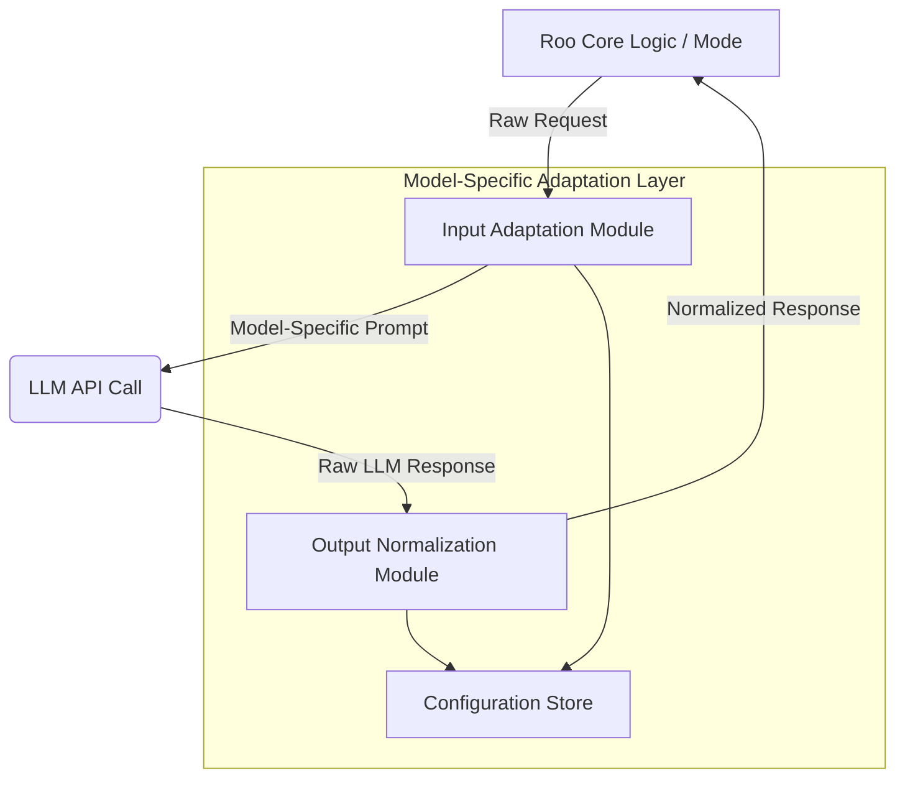

## 1. Introduction

This document outlines the design for a Model-Specific Adaptation Layer for Roo Code. The primary goal of this layer is to normalize behaviors across different Large Language Models (LLMs) such as Claude, GPT-4 variants, and Gemini, ensuring more consistent, predictable, and reliable operation of Roo Code. This addresses the observed issue where different LLMs respond differently to similar prompts, potentially disrupting user workflows and downstream processing within Roo Code's agentic framework.

This layer will handle model-specific nuances in input requirements and output characteristics, providing a standardized interface for Roo Code to interact with various LLMs. The insights driving this design are based on the research detailed in `research/raw/task_1.3/llm_behavioral_variations_research_log.md`.

## 2. Summary of Key LLM Behavioral Variations

The following key patterns of behavioral divergence across Claude, GPT, and Gemini models necessitate the adaptation layer:

### 2.1. Tone, Style, and Personality
*   **Claude (Opus, Sonnet):**
    *   *General Tone:* Often more human-like, natural, expressive, and empathetic. Can adopt various styles (e.g., humorous, conversational) effectively.
    *   *Potential Issues:* Can be prone to sycophancy or "arguing back" (Opus). May require prompting to be more direct.
*   **GPT (GPT-4o, GPT-4.1):**
    *   *General Tone:* Typically more neutral, robotic, academic, or dry. GPT-4.1 is noted for being very literal.
    *   *Potential Issues:* Can sound "stiff" or "lazy." May use "flowery language" if not guided. GPT-o1 (an older model) was noted for adding excessive unwanted commentary.
*   **Gemini (1.5 Pro/Flash, Advanced):**
    *   *General Tone:* Aims for a human-like writing style and can offer creative suggestions.
    *   *Potential Issues:* Can exhibit "silly refusals," make "strange claims," or have "factuality" issues impacting perceived tone and reliability.

### 2.2. Instruction Adherence, Reasoning, and Intent Interpretation
*   **Claude:**
    *   *Strengths:* Generally excels at following complex instructions, especially Sonnet 3.5 for precise adherence. Good at task decomposition. "Thinking Mode" in Sonnet 3.7 aids complex problem-solving by showing reasoning steps.
    *   *Weaknesses:* Can be more literal in interpreting intent compared to GPT-4o. Opus variant may sometimes "argue back" or not follow instructions as readily.
*   **GPT:**
    *   *Strengths:* GPT-4o is excellent at complex/abstract reasoning and understanding user intent beyond literal phrasing. GPT-4.1 excels at detailed instruction following but is very literal. GPT-4o is generally compliant and stable for orchestration.
    *   *Weaknesses:* GPT-4o can sometimes overlook details or miss nuance compared to Claude 3.5.
*   **Gemini:**
    *   *Strengths:* Strong general reasoning capabilities. Good formatting for tool inputs (important for orchestration).
    *   *Weaknesses:* Struggles with strict instruction adherence (1.5 Pro), can deviate from intended meaning or misinterpret user intent, especially in coding. Can be bad at understanding instructions generally.

### 2.3. Output Formatting and Verbosity
*   **Claude:**
    *   *Strengths:* Excels in producing longer-form content with a natural tone and word usage. Efficient token usage for detailed answers.
    *   *Weaknesses:* Output can sometimes be too verbose if not guided.
*   **GPT:**
    *   *Strengths:* GPT-4.1 is optimized for reliable format adherence. GPT-4o produces well-structured code.
    *   *Weaknesses:* Writing can be "stiff." Older models like GPT-4 cap output length. GPT-o1 adds unwanted commentary.
*   **Gemini:**
    *   *Strengths:* Human-like writing style. Good formatting for tool inputs.
    *   *Weaknesses:* Can be overly conservative with token usage, omitting details.

### 2.4. Accuracy, Hallucinations, and Reliability
*   **Claude:**
    *   *Strengths:* Sonnet 3.7 noted for consistency at lower temperatures.
    *   *Weaknesses:* Higher hallucination rates reported for some versions (e.g., Sonnet 3.5 at 8.7%). Can be stubborn about correcting its own errors and may recommend more errors in code than GPT-4. Lacks stability for orchestration (output varies for same input).
*   **GPT:**
    *   *Strengths:* Generally reliable with low hallucination rates (GPT-4 Turbo ~1.7%). GPT-4o is very stable for orchestration. Least likely to suggest errors in code (GPT-4).
    *   *Weaknesses:* GPT-4.1 accuracy can dip with very large inputs. GPT-4 prone to crashes.
*   **Gemini:**
    *   *Strengths:* Flash version reported with the lowest hallucination rates in one comparison.
    *   *Weaknesses:* Generally the weakest on factual accuracy, with high hallucination rates (1.5 Pro ~9.1%). History of "factuality" issues and sourcing problems. Unreliable for orchestration due to making things up or strange claims.

### 2.5. Context Window and Memory
*   **Claude:** Large context window (200k tokens / ~150k words for Opus/Sonnet). Good memory for original instructions.
*   **GPT:** GPT-4o has a ~128k token window (~96k words). GPT-4.1 offers ~1M tokens. Older GPT-4 has more limited chat history/memory.
*   **Gemini:** Largest context windows (1M-2M tokens for Pro versions). However, some reports indicate struggles with memory and context understanding in practice (Gemini Advanced), despite the large window.

### 2.6. Error Handling, Refusals, and Censorship
*   **Claude:** High refusal rate due to strong ethical guardrails and censorship ("INSANE refusal rate"). Can be stubborn about self-correction.
*   **GPT:** Less restrictive on refusals ("no moral training" for GPT-4o). GPT-o1 adds unwanted commentary.
*   **Gemini:** "Silly refusals," factuality issues, censorship can limit responses. Can get "triggered very randomly" or claim inability for tasks it can perform.

### 2.7. Multimodal Capabilities
*   **Claude:** Strong visual analysis (Sonnet 3.5 - charts, handwriting, diagrams). Cannot generate images.
*   **GPT-4o:** Strongest in multimodal benchmarks. Natively multimodal (text, image, audio, video understanding via frames). Image generation via DALL-E. API audio input planned.
*   **Gemini:** Broadest native support (text, image, audio, video). Good for video processing. Image generation can be inconsistent or refused.

### 2.8. API Stability & Developer Friendliness
*   **Claude:** Sonnet 3.7 noted for consistency at lower temperatures. Some UI limitations reported (no share/edit).
*   **GPT-4o:** Very stable for orchestration.
*   **Gemini:** Unreliable for orchestration. API quality can differ from web UI.

## 3. Architectural Design of the Adaptation Layer

The Model-Specific Adaptation Layer (MSAL) will be a modular component within Roo Code, positioned between Roo's core logic (including modes and the Boomerang task system) and the actual LLM API communication pathways.



### 3.1. Core Modules

#### 3.1.1. Input Adaptation Module (IAM)
This module preprocesses requests from Roo Code before they are sent to a specific LLM.
*   **Responsibilities:**
    *   **Prompt Templating & Engineering:** Apply model-specific prompt templates. This includes:
        *   Adding model-specific system prompts to set tone, style, compliance expectations (e.g., "You are a helpful assistant that provides concise, factual answers" for GPT, vs. "You are a creative and expressive assistant" for Claude in certain modes).
        *   Structuring prompts to leverage model strengths (e.g., detailed step-by-step for GPT-4.1's literalness, more conversational for Claude).
        *   Adding formatting instructions if a model is known to be inconsistent (e.g., "Ensure all code blocks are fenced with triple backticks and specify the language").
    *   **Instruction Clarification/Refinement:** For models prone to misinterpretation (e.g., Gemini) or over-literalness (GPT-4.1), the IAM might include logic to rephrase or add clarifying context to instructions based on predefined rules or patterns.
    *   **Context Window Management:**
        *   Truncate or summarize context to fit within the specific LLM's context window.
        *   Employ model-aware chunking strategies if necessary for very long contexts, considering the model's recall abilities over long sequences.
    *   **Capability-Specific Adjustments:** If a task requires a capability where a model is weak (e.g., Gemini and complex coding, or Claude and image generation), the prompt might be adjusted to be more explicit or to suggest alternative approaches the model handles better.

#### 3.1.2. Output Normalization Module (ONM)
This module post-processes raw responses received from the LLM before they are passed back to Roo Code's core logic.
*   **Responsibilities:**
    *   **Parsing & Stripping:**
        *   Remove extraneous text (e.g., conversational preambles/postambles like "Certainly, here is..." or "I hope this helps!").
        *   Strip unnecessary self-correction narratives or disclaimers unless explicitly useful for the task.
        *   Handle model-specific output quirks (e.g., Gemini's tendency to sometimes claim inability then perform the task).
    *   **Structural Reformatting:**
        *   Ensure consistent output structures (e.g., valid JSON if requested, standardized Markdown, consistently fenced code blocks with language identifiers).
        *   Reformat lists, headings, or other structural elements to a Roo Code standard.
    *   **Tone, Style, and Verbosity Adjustment:**
        *   Apply rules to shift tone if needed (e.g., make GPT output slightly more "personable" for user-facing modes, or Claude more "direct" for internal processing).
        *   Control verbosity: expand terse outputs (e.g., from Gemini if it omits details) or condense overly verbose ones (e.g., from Claude if not required by the task) based on Roo mode requirements.
    *   **Error & Refusal Mapping:**
        *   Map model-specific error codes/messages (beyond standard HTTP errors like 429) to a standardized set of Roo Code error types.
        *   Interpret and normalize refusal messages (e.g., ethical refusals from Claude, "silly refusals" from Gemini) into consistent Roo Code notifications or error states. This allows Roo to handle them uniformly.
    *   **Factuality/Confidence Handling (Experimental):**
        *   For models with higher hallucination tendencies (Claude, Gemini), if the task involves factual information retrieval, the ONM could potentially append a "confidence indicator" or a suggestion for user verification, based on heuristics or model-provided scores if available.

#### 3.1.3. Configuration Store
This module will store model-specific rules, templates, and parameters used by the IAM and ONM.
*   **Content:**
    *   System prompt templates per model/per Roo mode.
    *   Instruction rephrasing rules.
    *   Context window limits and preferred truncation/summarization strategies.
    *   Output parsing regexes or rules.
    *   Tone/style adjustment lexicons or rules.
    *   Error/refusal message mapping tables.
    *   Model capability flags (e.g., `supports_image_generation: true/false`, `strong_at_complex_reasoning: true/false`).
*   **Maintainability:** This store should be easily updatable as new models are added or existing models evolve. A structured format like YAML or JSON is recommended.

### 3.2. Data Flow
1.  A Roo Code mode generates a task request (prompt, context, target LLM).
2.  The request is passed to the MSAL's **Input Adaptation Module (IAM)**.
3.  The IAM retrieves model-specific configurations from the **Configuration Store**.
4.  The IAM transforms the raw request into a model-optimized prompt.
5.  The optimized prompt is sent to the target LLM API.
6.  The raw LLM response is received by the MSAL's **Output Normalization Module (ONM)**.
7.  The ONM retrieves model-specific configurations from the **Configuration Store**.
8.  The ONM transforms the raw response into a standardized, normalized format.
9.  The normalized response is returned to the originating Roo Code mode/logic.

## 4. Integration Strategy for Roo Code

The MSAL will be integrated as a middleware layer within Roo Code's existing LLM communication pathways.

### 4.1. Key Integration Points:
*   **Before LLM API Call:** All outgoing requests to any LLM will first pass through the IAM. Roo's existing LLM client/handler will be modified to invoke the IAM.
*   **After LLM API Response:** All incoming raw responses from any LLM will immediately pass through the ONM before any further processing by Roo Code.

### 4.2. Interaction with Boomerang Task System:
*   The Boomerang task system will remain largely unaware of the MSAL's internal workings. It will continue to dispatch tasks with a target LLM specified (or a default).
*   The MSAL ensures that the task execution (LLM interaction part) is normalized, so the results returned to the Orchestrator or other modes are more consistent.

### 4.3. Interaction with Mode Configurations:
*   Mode configurations might include preferences that influence the MSAL. For example:
    *   A `code` mode might prefer more direct, less conversational outputs.
    *   A `research` mode might tolerate more verbosity.
    *   These preferences can be passed to the MSAL or used to select specific rule sets from the Configuration Store.
*   The MSAL's Configuration Store will be the primary source of model-specific adaptation rules, but mode-level overrides or preferences can provide an additional layer of control.

### 4.4. Configuration and Maintenance:
*   The MSAL's Configuration Store (e.g., `msal_config.yaml`) will be a critical part of the Roo Code repository.
*   It will need to be version-controlled and updated regularly as:
    *   New LLMs are integrated into Roo Code.
    *   Existing LLMs update their APIs or behaviors.
    *   New behavioral nuances are discovered through usage.
*   A dedicated section in Roo Code's documentation will cover MSAL configuration and best practices for updating it.

## 5. Illustrative Examples

These conceptual examples demonstrate how the MSAL might work.

### Example 1: Code Generation Task

**Roo Code Raw Request (Simplified):**
```json
{
  "llm_target": "Claude-Sonnet-3.5", // or "GPT-4o", "Gemini-1.5-Pro"
  "task_type": "code_generation",
  "prompt": "Write a Python function to calculate factorial. Include a docstring and type hints.",
  "mode_preferences": { "verbosity": "concise", "style": "professional" }
}
```

**A. Input Adaptation (IAM):**

*   **If Target = Claude-Sonnet-3.5:**
    *   System Prompt: "You are an expert Python programmer. Provide clear, correct, and well-documented code. Adhere strictly to the user's requirements."
    *   Prompt: (Original prompt might be used directly as Claude is good with complex instructions)
*   **If Target = GPT-4o:**
    *   System Prompt: "You are a helpful coding assistant. Generate accurate Python code. Ensure docstrings and type hints are included as specified."
    *   Prompt: (Original prompt, perhaps with an added "Ensure the output contains only the Python code block.")
*   **If Target = Gemini-1.5-Pro:**
    *   System Prompt: "You are a Python code generation model. Your task is to write a function for factorial. Include a docstring and type hints. Provide only the code."
    *   Prompt: (Original prompt, potentially rephrased for clarity if Gemini is known to misinterpret this type of request).

**B. Potential Raw LLM Outputs (Conceptual):**

*   **Claude-Sonnet-3.5 (Raw):**
    ```python
    # Sure, here is a Python function to calculate factorial:
    def factorial(n: int) -> int:
        """
        Calculates the factorial of a non-negative integer.
        n: The non-negative integer.
        Returns: The factorial of n.
        Raises: ValueError if n is negative.
        """
        if n < 0:
            raise ValueError("Factorial is not defined for negative numbers.")
        elif n == 0:
            return 1
        else:
            res = 1
            for i in range(1, n + 1):
                res *= i
            return res
    # I hope this helps!
    ```
*   **GPT-4o (Raw):**
    ```python
    def factorial(n: int) -> int:
        """Calculate the factorial of a non-negative integer n.

        Args:
            n (int): A non-negative integer.

        Returns:
            int: The factorial of n.

        Raises:
            ValueError: If n is negative.
        """
        if n < 0:
            raise ValueError("Input must be a non-negative integer.")
        elif n == 0 or n == 1:
            return 1
        else:
            result = 1
            for i in range(2, n + 1):
                result *= i
            return result
    ```
*   **Gemini-1.5-Pro (Raw - might be more verbose or add explanations outside code):**
    ```
    Okay, I can help with that! Factorial is a common mathematical function. Here's the Python code:

    ```python
    def factorial(n: int) -> int:
        """
        Computes the factorial of a given non-negative integer.
        Type hints are included for clarity.
        """
        if not isinstance(n, int) or n < 0:
            raise ValueError("Factorial input must be a non-negative integer")
        if n == 0:
            return 1
        
        val = 1
        for i in range(1, n + 1):
            val = val * i
        return val
    ```
    This function first checks for invalid input. Then it handles the base case of 0! = 1. Otherwise, it iteratively multiplies.
    ```

**C. Output Normalization (ONM) -> Standardized Roo Code Response:**

*   **Normalized Output (Goal: just the code, consistent docstring style if possible):**
    ```python
    def factorial(n: int) -> int:
        """
        Calculates the factorial of a non-negative integer.

        Args:
            n (int): The non-negative integer.

        Returns:
            int: The factorial of n.

        Raises:
            ValueError: If n is negative.
        """
        if n < 0:
            raise ValueError("Factorial is not defined for negative numbers.")
        elif n == 0 or n == 1: # Standardized base case
            return 1
        else:
            res = 1
            for i in range(1, n + 1): # Consistent loop start
                res *= i
            return res
    ```
    *   *Actions by ONM:* Stripped preambles/postambles. Ensured only code block returned. Potentially minor style adjustments in comments/logic for consistency (e.g., base case `n==0 or n==1`, loop range).

### Example 2: Information Retrieval Task (High Hallucination Risk)

**Roo Code Raw Request (Simplified):**
```json
{
  "llm_target": "Gemini-1.5-Pro", // Known for factuality issues sometimes
  "task_type": "information_retrieval",
  "prompt": "What were the main contributing factors to the 2008 financial crisis?",
  "mode_preferences": { "style": "summary", "max_points": 3 }
}
```

**A. Input Adaptation (IAM):**
*   System Prompt (for Gemini): "You are a helpful assistant providing factual summaries. Please list the top 3 contributing factors to the 2008 financial crisis. Be concise."
*   Prompt: (Original prompt, perhaps with "Cite sources if possible, though not strictly required for this summary format.")

**B. Potential Raw LLM Output (Gemini - Conceptual, might mix valid points with less accurate ones or odd phrasing):**
```
The 2008 financial meltdown was super complex! Here are some big reasons:
1.  Subprime mortgages were given out like candy to folks who couldn't really afford them. Risky!
2.  Those complicated CDOs and MBS things all got tangled up, and nobody knew what they were worth.
3.  The government didn't watch the banks close enough, letting them take huge gambles. AIG also played a big part with credit default swaps.
```

**C. Output Normalization (ONM) -> Standardized Roo Code Response:**
*   **Normalized Output:**
    ```text
    Key contributing factors to the 2008 financial crisis include:
    1.  Widespread issuance of subprime mortgages to borrowers with poor credit.
    2.  Proliferation of complex financial derivatives (e.g., CDOs, MBS) that obscured risk.
    3.  Insufficient regulatory oversight of financial institutions and their risk-taking activities.

    [INFO: LLM response. Please verify critical facts independently due to potential for hallucination.]
    ```
    *   *Actions by ONM:* Rephrased for a more formal/summary tone. Stripped informal language ("super complex," "like candy"). Ensured it focused on 3 points. Added a factuality warning because Gemini was used and the task is information retrieval.

## 6. Future Considerations
*   **Dynamic Rule Adjustment:** Explore mechanisms for the MSAL to learn or adapt its rules over time based on LLM performance feedback.
*   **Capability Probing:** Implement a gentle probing mechanism where, if an LLM's capability for a specific sub-task is uncertain (e.g., a specific type of formatting), the MSAL could issue a small, preliminary prompt to test it before committing to a larger request.
*   **Cost Optimization:** The IAM could incorporate model-specific cost considerations, perhaps choosing a cheaper model for simpler sub-tasks if multiple are available and suitable.
*   **Advanced Error Recovery:** Beyond mapping errors, the ONM could attempt model-specific retry strategies for certain transient errors.

This design provides a foundational framework for the Model-Specific Adaptation Layer, aiming to significantly improve the consistency and reliability of Roo Code's interactions with diverse LLMs.