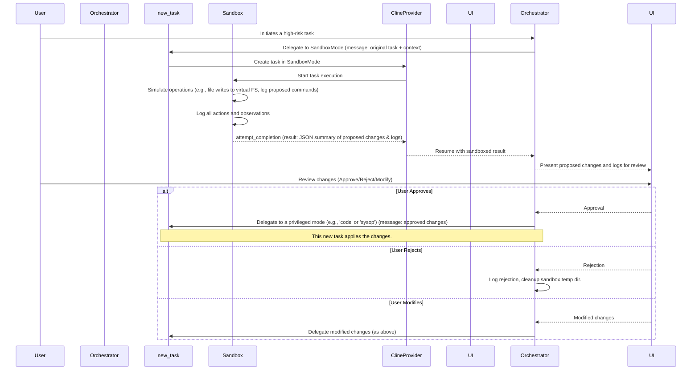

# Technical Specification for Sandbox Mode in Roo Code

## 1. Rationale and Goals

### 1.1 Rationale
LLM-based agents like Roo Code can perform a wide range of operations, including file modifications, command execution, and API interactions. While powerful, these capabilities introduce risks if an operation behaves unexpectedly or maliciously. A "Sandbox Mode" is proposed to provide an isolated environment for executing potentially high-risk operations, allowing for observation, validation, and controlled application of changes. This mitigates risks of unintended system alterations, data corruption, or security vulnerabilities.

### 1.2 Goals
-   **Isolation:** Execute high-risk tasks in an environment with restricted access to the file system, network, and other system resources.
-   **Observation:** Allow monitoring of a sandboxed task's behavior, including operations attempted and resources accessed.
-   **Controlled Application:** Ensure that any changes or outputs from a sandboxed task are presented to the user for explicit approval before being applied to the live environment.
-   **Rollback:** Provide mechanisms to easily revert any changes made or proposed by a sandboxed task if they are deemed undesirable or erroneous.
-   **Integration:** Seamlessly integrate the sandbox mode within Roo Code's existing task delegation and mode management architecture.

## 2. Proposed Architecture of the Sandbox Mode

### 2.1 Sandbox Mode Definition
A new mode, `sandbox`, will be defined within Roo Code's mode configuration system (e.g., in `.roomodes` or `shared/modes.ts`).

```typescript
// Example Sandbox Mode Configuration
const sandboxModeConfig = {
  slug: "sandbox",
  name: "🛡️ Sandbox Mode",
  roleDefinition: `You are Roo in Sandbox Mode. Your primary function is to execute potentially high-risk tasks in a controlled and isolated environment. 
  You will clearly state the actions you intend to perform. All operations that would alter the system state (e.g., file writes, command execution) will be logged and will NOT be executed directly. 
  Instead, you will propose these changes. Your output will be a structured summary of intended actions and their expected outcomes, which will be reviewed before any actual changes are applied. 
  You have restricted capabilities. Focus on accurately simulating the task and detailing proposed changes.`,
  groups: [ // Initially very restrictive, can be adjusted
    { group: "read", restricted: true, pattern: "^/tmp/sandbox/[TASK_ID]/.*$" }, // Read access only within a task-specific temp dir
    { group: "edit", restricted: true, pattern: "^/tmp/sandbox/[TASK_ID]/.*$" }, // Edit access only within a task-specific temp dir
    { group: "command", restricted: true, pattern: "^(echo|ls|cat)$" }, // Highly restricted commands, primarily for observation
    { group: "mcp", restricted: true, pattern: "^(brave-search/brave_web_search)$" } // Example: Allow only web search
    // No direct access to broader file system, arbitrary commands, or sensitive MCP tools initially.
  ],
  customInstructions: `
    - Log every significant action you attempt (e.g., "Attempting to read file X", "Proposing to write Y to file Z").
    - Do not attempt to bypass sandbox restrictions.
    - Clearly differentiate between simulated actions and proposed changes.
    - Output a final JSON object summarizing proposed changes (e.g., files to be created/modified with their content, commands to be run).
  `
};
```

### 2.2 Isolation Mechanisms

-   **Restricted Tool Permissions:** The `sandbox` mode will have highly restricted tool permissions by default (as defined in `groups`).
    -   File system access (read/edit) will be limited to a temporary, task-specific directory (e.g., `/tmp/sandbox/[TASK_ID]/`). This directory will be created when the sandbox task starts and can be cleaned up afterwards.
    -   Command execution will be limited to a minimal set of safe, observational commands (e.g., `echo`, `ls`).
    -   API/MCP tool access will be whitelisted to only non-state-altering tools or tools that can operate in a "dry-run" mode.
-   **Virtual File System (Conceptual):** Operations targeting the actual file system will be intercepted.
    -   Reads from outside the sandbox's temporary directory might be allowed (for context) but logged.
    -   Writes will be redirected to a shadow/virtual file system within the sandbox's temporary directory. The final state of this virtual FS will form part of the "proposed changes."
-   **Command Interception:** Commands deemed risky will not be executed directly. Instead, the command and its arguments will be logged as a "proposed command."
-   **Network Access Control (Future):** Future enhancements could include restricting network access to whitelisted domains or disabling it entirely for certain sandboxed tasks.
-   **Resource Limits (Future):** OS-level sandboxing (e.g., Docker, Firecracker) could be used for stronger isolation and resource (CPU, memory) limits for very high-risk or untrusted code execution tasks (e.g., if Roo Code is asked to run user-provided scripts). This is a more complex, longer-term consideration.

### 2.3 Task Flow for Sandboxed Operations



## 3. Identifying and Handling High-Risk Operations

### 3.1 Identification Criteria
Tasks or operations can be designated as "high-risk" based on:
-   **Tool Usage:** Use of tools known to alter system state (e.g., `write_to_file`, `apply_diff`, `execute_command` with non-whitelisted commands, certain MCP tools).
-   **Task Keywords/Intent:** NLP analysis of the task description to identify intents like "delete files," "install software," "modify critical configuration."
-   **Source of Code/Instructions:** If the task involves executing code or instructions from an untrusted source.
-   **User Flagging:** Users can explicitly mark a task as high-risk.
-   **Cost/Resource Prediction (from Task 2.2):** Operations predicted to be unusually costly or resource-intensive might be preemptively sandboxed.
-   **Mode-based Heuristics:** Certain modes might inherently have operations that are always considered high-risk if they exceed certain parameters.

### 3.2 Routing to Sandbox
-   The **Orchestrator mode** will be primarily responsible for identifying high-risk tasks.
-   Based on the criteria above, if a sub-task is deemed high-risk, the Orchestrator will use the `new_task` tool to delegate it specifically to the `sandbox` mode.
-   The "Pre-Task-Creation Hook" (from `task_boundary_enforcement_spec.md`) can be enhanced in `newTaskTool.ts` or within the Orchestrator's logic to check these criteria.

## 4. Design of Rollback Capabilities

Rollback is multifaceted, applying to both the sandboxed operation itself and any changes applied after approval.

### 4.1 Rollback of Sandboxed Operation (Pre-Approval)
-   **Temporary Workspace:** All file modifications within the sandbox occur in a task-specific temporary directory (e.g., `/tmp/sandbox/[TASK_ID]/`). If the user rejects the proposed changes, this directory is simply deleted.
-   **Journaling of Proposed Actions:** The sandbox logs all intended actions (file changes, commands). If rejected, this log serves as a record, but no actions were taken on the live system.

### 4.2 Rollback of Applied Changes (Post-Approval)
This is more complex as changes have been applied to the live system.
-   **Snapshotting (File System):**
    -   Before applying approved file changes, the system could (optionally, for critical operations) create snapshots or backups of the targeted files/directories.
    -   Version Control Systems (like Git) are ideal: If the project is a Git repository, changes should be applied on a new branch. Rollback means simply discarding the branch or reverting the commit.
    -   For non-Git contexts, a simple backup (e.g., `file.ext.bak`) could be created.
-   **Change Journaling for Applied Operations:**
    -   Maintain a log of operations applied *after* user approval (e.g., which files were written, which commands were run).
    -   This journal can guide manual rollback or be used by a "rollback tool" that attempts to reverse operations (e.g., delete created files, revert file changes from backups, run compensating commands if possible).
-   **Compensating Transactions:** For some operations (e.g., API calls), a direct rollback isn't possible. A compensating transaction (e.g., a "delete" API call to undo a "create" API call) might be necessary. The sandbox output should ideally include information about potential compensating actions if it proposes such operations.

### 4.3 User Interface for Rollback
-   If changes were applied via Git, the UI could suggest Git commands to revert.
-   For file backups, the UI could offer to restore from `.bak` files.
-   Display the change journal to aid manual rollback.

## 5. Integration Plan (Roo Code's Extension/Mode Architecture)

Leveraging insights from `boomerang_task_system_analysis.md` and `mode_configuration_architecture_analysis.md`:

### 5.1 Defining the Sandbox Mode
-   Add `sandboxModeConfig` to `shared/modes.ts` or allow its definition via `.roomodes`.
-   The `CustomModesManager` will load it like any other mode.

### 5.2 Orchestrator Mode Modification
-   Enhance the Orchestrator's logic to include risk assessment for sub-tasks.
-   If high-risk, the Orchestrator will use `new_task` to delegate to `mode: "sandbox"`.
-   The Orchestrator will be responsible for interpreting the structured JSON output from the sandbox (proposed changes) and presenting it to the user.
-   Upon approval, the Orchestrator will then delegate the *actual execution* of these approved changes to an appropriate privileged mode (e.g., `code` mode for file writes, `debug` or a new `sysop` mode for commands).

### 5.3 `Task` Class and `newTaskTool.ts`
-   **`newTaskTool.ts`:**
    -   When creating a task for `sandbox` mode, it could initialize the temporary sandbox directory (`/tmp/sandbox/[TASK_ID]/`).
-   **`Task.ts` (`resumePausedTask`):**
    -   When a `sandbox` task completes, `resumePausedTask` will receive the JSON summary of proposed changes. This needs to be handled distinctly from regular task results, likely passed directly to the Orchestrator for UI presentation rather than just being added to chat history.
    -   The "Post-Task-Execution Hook" can be used to parse and validate this JSON output.

### 5.4 Tool Modifications (Interception Layer)
-   Core tools (`write_to_file`, `apply_diff`, `execute_command`, etc.) need to become "sandbox-aware."
-   When `(await provider.getState()).mode === "sandbox"`:
    -   `write_to_file`, `apply_diff`: Instead of writing to the actual path, write to the sandboxed virtual path (e.g., `sandbox_temp_dir + original_path`). Log the intended operation and the virtual path used.
    -   `execute_command`: If the command is not on the sandbox's safe whitelist, log the command as "proposed" and do not execute. Return a simulated success or a message indicating it's a proposal.
    -   `read_file`: Reads from within the sandbox's temp dir are allowed. Reads from outside are logged and may be allowed (for context) or restricted based on policy.
-   This could be implemented by a wrapper around the tools or by adding conditional logic within each tool.

### 5.5 User Interaction Flow for Sandboxed Operations
1.  Orchestrator identifies a high-risk task and delegates it to Sandbox Mode.
2.  Sandbox Mode executes, simulating operations and generating a list of proposed changes (e.g., diffs for file modifications, list of commands to run).
3.  Sandbox Mode completes, returning the proposed changes (e.g., as a JSON object) to the Orchestrator.
4.  Orchestrator presents these proposed changes to the user via a dedicated UI component (e.g., a diff viewer for file changes, a list of commands with explanations).
5.  User reviews the proposed changes and can:
    -   **Approve:** Orchestrator delegates the approved changes to a privileged mode for actual execution.
    -   **Reject:** Orchestrator discards the proposed changes. The sandbox's temporary workspace is cleaned up.
    -   **Modify & Approve (Optional):** User edits the proposed changes (e.g., modifies a script, unselects certain file changes) before approval.
6.  After application (if approved), the user is informed of the outcome, and options for rollback (if implemented for that change type) are presented.

## 6. Logging and Observation
-   The Sandbox Mode itself will be verbose in its logging (to its internal task log/history).
-   All intercepted operations (file access attempts, command execution attempts) will be logged with their original parameters and how they were handled by the sandbox (e.g., redirected, proposed, denied).
-   The final output of a sandboxed task will include a summary of these logs along with the proposed changes.
-   The `.roo/logs/sandbox/` directory can store detailed logs for each sandboxed task.

## 7. Future Considerations
-   **Granular Permissions within Sandbox:** Allow dynamic adjustment of sandbox permissions for specific tasks if the default is too restrictive but full execution is still too risky.
-   **Third-party Code Execution:** For running truly untrusted code (e.g., a Python script generated by the LLM to solve a problem), integration with containerization technologies (Docker, gVisor) would be necessary for stronger isolation.
-   **Automated Analysis of Sandbox Output:** Use another LLM call or heuristic checks to analyze the proposed changes from the sandbox for potential risks before even presenting to the user.

This specification provides a foundational design for a Sandbox Mode in Roo Code, aiming to significantly enhance safety and control when dealing with high-risk operations.